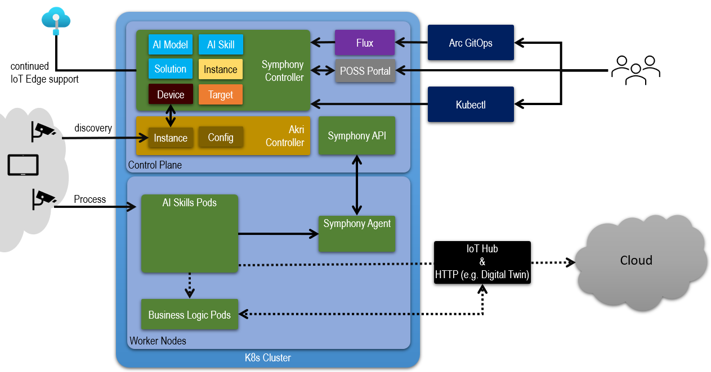

# Percept Open Source Project (POSS)

Azure Percept Open-Source Project is a framework for creating, deploying, and operating environment-aware solutions at scale that use artificial intelligence (AI) at the edge with the control and flexibility of open-source natively on your environment. POSS is fully open-sourced and leverages the open-source software (OSS) community to deliver enhanced experiences. And, as a self-managed solution, you can host the experience on your own [Kubernetes](https://kubernetes.io/) clusters.

POSS has a no- to low-code portal experience as well as APIs that can be used to build custom Edge AI applications. It supports running Edge AI apps by utilizing cameras, sensors, and Edge devices with different Edge runtimes and accelerators across multiple locations at scale. Since it is designed with machine learning operations (MLOps) in mind, it provides support for active learning, continuous training, and data gathering using your machine learning (ML) models running at the edge.

# Characteristics

- **An integrated developer experience.** 
    
    You can easily build camera-based Edge AI apps using first- and third-party ML models. In one seamless flow, you can leverage pre-built models from our partner’s Model Zoo and create your own ML models with [Azure Custom Vision](https://azure.microsoft.com/en-us/services/cognitive-services/custom-vision-service/#overview).
- **Solution deployment and management experience at scale**. 
    
    POSS is Kubernetes native, so you can run the management experience wherever [Kubernetes](https://kubernetes.io/) runs; on prem, hybrid, cloud, or multi-cloud environments. You can manage your experience using [Kubernetes](https://kubernetes.io/) native tools such as [kubectl](https://kubernetes.io/docs/reference/kubectl/kubectl/), and/or our no- to low-code native web portal. Edge AI apps and assets you create are projected and managed as [Kubernetes](https://kubernetes.io/) objects, which allows you to rely on the [Kubernetes](https://kubernetes.io/) control plane to manage the state of your Edge AI assets across many environments at scale. Each POSS solution can span multiple environments meaning that your solution can have one component running on [AKS on Azure Stack HCI](https://docs.microsoft.com/en-us/azure-stack/aks-hci/) and another component running on [EFLOW](https://docs.microsoft.com/en-us/windows/iot/iot-enterprise/azure-iot-edge-for-linux-on-windows) and POSS can control your solution as one manageable unit.

- **Standard-based.**

    POSS is built on and supports popular industrial standards, protocols, and frameworks like [Open Platform Communications Unified Architecture (OPC-UA)](https://opcfoundation.org/about/opc-technologies/opc-ua/), [OpenTelemetry](https://opentelemetry.io/), [CloudEvents](https://cloudevents.io/), [Distributed Application Runtime (Dapr)](https://dapr.io/), [Message Queuing Telemetry Transport (MQTT)](https://mqtt.org/), [Open Neural Network Exchange (ONNX)](https://onnx.ai/), [Akri](https://github.com/project-akri/akri), [kubectl](https://kubernetes.io/docs/reference/kubectl/kubectl/), [Helm](https://helm.sh/), and many others. 

- **Zero-friction adoption**

    Even without any Edge hardware, you can get started with a few commands, then seamlessly transit from prototype/pilot to production at scale. POSS has an easy-to-use no- to low-code portal experience that allows developers to create and manage Edge AI solutions in minutes instead of days or months. 

- **Azure powered and platform agnostic**

    POSS natively uses and supports Azure Edge and AI Services like [Azure IoT Hub](https://docs.microsoft.com/azure/iot-hub/), [Azure IoT Edge](https://azure.microsoft.com/services/iot-edge/), [Azure Cognitive Services](https://azure.microsoft.com/services/cognitive-services/), [Azure Storage](https://azure.microsoft.com/products/category/storage/), [Azure ML](https://azure.microsoft.com/services/machine-learning/), [Azure Monitor](https://docs.microsoft.com/azure/azure-monitor/), [Azure Arc](https://learn.microsoft.com/azure/azure-arc/overview), and so on. At the same time, it also allows you to modify the experience for use cases that require the use of other services (Azure or non-Azure) or other Open-Source Software (OSS) tools. 

# Get Started
Follow [this document](docs/tutorial/setup-guide.md) to get started in minutes. 

> [!NOTE]
> The experiences in this repository should be considered to be in preview/alpha. Significant portions of these experiences are subject to change without warning.

# How It Works

POSS has three high-level components: portal, controller-API and agent. You can interact with POSS through its portal, Kubernetes tools like [kubectl](https://kubernetes.io/docs/reference/kubectl/kubectl/), and [Azure Arc](https://docs.microsoft.com/en-us/azure/azure-arc/overview) through [GitOps](https://docs.microsoft.com/en-us/azure/azure-arc/kubernetes/conceptual-gitops-flux2), as shown in the following diagram.

* **Portal** provides an intuitive graphic interface for users to create, edit and manage their intelligent edge payloads. It offers an AI model zoo, a drag-n-drop AI skill editor, live camera previews and many other features. Read more about our project [here](./docs/POSS-TOC.md).
* **Controller-API** is a Kubernetes operator that manages states of objects of a POSS object model (code named Symphony). Read more about POSS API [here](./docs/api/README.md).
* **Agent** offers a number of services to edge payloads, such as retrieving new AI skill definitions and reporting object states.

# POSS and API documentation

To view a list of links to information about POSS and the APIs, go to [Azure Percept Open Source Project (POSS) documentation](./docs/POSS-TOC.md).

# Contributing

This project welcomes contributions and suggestions.  Most contributions require you to agree to a
Contributor License Agreement (CLA) declaring that you have the right to, and actually do, grant us
the rights to use your contribution. For details, visit [Contributor License Agreements](https://cla.opensource.microsoft.com).

When you submit a pull request, a CLA bot will automatically determine whether you need to provide
a CLA and decorate the PR appropriately (e.g., status check, comment). Simply follow the instructions
provided by the bot. You will only need to do this once across all repos using our CLA.

This project has adopted the [Microsoft Open Source Code of Conduct](https://opensource.microsoft.com/codeofconduct/).
For more information see the [Code of Conduct FAQ](https://opensource.microsoft.com/codeofconduct/faq/) or
contact [opencode@microsoft.com](mailto:opencode@microsoft.com) with any additional questions or comments.

# Join the discussion

To report bugs, send feedbacks, or discuss any POSS related topics, please join our Discord server: 

# Trademarks

This project may contain trademarks or logos for projects, products, or services. Authorized use of Microsoft 
trademarks or logos is subject to and must follow 
[Microsoft's Trademark & Brand Guidelines](https://www.microsoft.com/en-us/legal/intellectualproperty/trademarks/usage/general).
Use of Microsoft trademarks or logos in modified versions of this project must not cause confusion or imply Microsoft sponsorship.
Any use of third-party trademarks or logos are subject to those third-party's policies.

# Privacy Notice

The software may collect information about your use of the software and send it to Microsoft.
Microsoft may use this information to provide services and improve our products and services.
You may turn off the telemetry as described in the repository or clicking settings on top right
corner. Our privacy statement is located at [Microsoft Privacy Statement](https://go.microsoft.com/fwlink/?LinkID=824704). You can learn more about data collection and use in the help documentation and our privacy
statement. Your use of the software operates as your consent to these practices.

