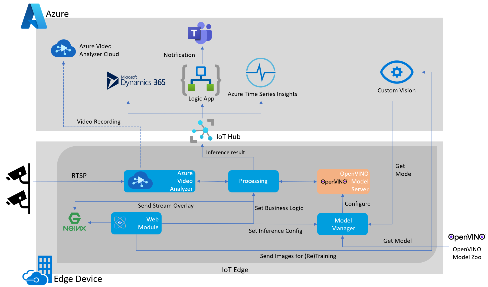

| description                                                                                                                                                                                                                          | products                                                               | page_type       | description                     |
| ------------------------------------------------------------------------------------------------------------------------------------------------------------------------------------------------------------------------------------ | ---------------------------------------------------------------------- | --------------- | ------------------------------- |
| This is an easy-to-use UI solution showing how to realize a your own machine learning solution concept in a single day without requiring any Machine Learning expertise, run with hardware accleration on edge with retraining loop. | - Azure Stack  -Custom Vision -Onnxruntime -OpenVINO Model Server -OpenVINO  -Azure IoTEdge -AVA *RTSP Source  *HTTP/GRPC Extension   | sample solution | -json -python -javascript |

# Vision on Edge Solution

This is a solution showing how to deploy a Custom Vision model to Azure IoT edge device and get Machine learning solution up and running in a single day.
You can define your location, camera and set up objects to detect example: any manufacturing parts, defected parts, etc. while keeping your video footage private, lowering your badnwidth costs and even running everything offline. This solution is capable of processing multiple cameras using Microsoft AVA.

Check out [this video](https://www.youtube.com/watch?v=17UW6veK7SA) to see brief introduction in action and understand how the value is delivered:

## What's New

### Model Cascading

You can now combine models to create more advanced computer vision solutions easily with drag-n-drop cascading. Drag-n-drop cascading allows you to use a combination of Object Detector and Classifier models in a pipeline fashion to achieve insights that were not easily achievable before. Your Models can be from:

* Custom Vision: You can create/train your own CNN models based on images coming from RTSP camera feeds. Created models are in OpenVINO format and are optimized for Intel CPU/VPUs.
* OpenVINO Model Zoo: Pre-trained, optimized, deep learning models by Intel for use with Intel CPU/VPUs. These generic yet performant models are ready for use without any need for training.
 

### OpenVINO Model Zoo

OpenVINO Model Zoo is now the first of many official Model Zoos available for use. OpenVINO Model Zoo is a library of pre-trained, optimized, deep learning models by Intel for use with Intel CPU/VPUs. You can use these models without any need for training and they can be used in combination with Custom Vision models to create your desired AI Logic/Solution! The following models are currently available as part of the model zoo:

* [age-gender-recognition-retail-0013](https://github.com/openvinotoolkit/open_model_zoo/blob/master/models/intel/age-gender-recognition-retail-0013/README.md)
* [emotions-recognition-retail-0003](https://github.com/openvinotoolkit/open_model_zoo/blob/master/models/intel/emotions-recognition-retail-0003/README.md)
* [face-detection-retail-0005](https://github.com/openvinotoolkit/open_model_zoo/blob/master/models/intel/face-detection-retail-0005/README.md)

# Table of Content

- [Prerequisites](#prerequisites)
  * [Hardware](#hardware)
  * [Services](#services)
- [Architecture](#architecture)
- [Get Started: Vision on Edge Installer](#get-started-vision-on-edge-installer)
  * [For Azure IoT Edge](#for-azure-iotedge-devices-recommended)
    + [Option 1: Azure Shell Installer](#option-1-azure-shell-installer-recommended)
    + [Option 2: Azure ARM Template](#option-2-azure-arm-template)
- [Other Tutorials](#other-tutorials)
  * [Video Tutorials](#video-tutorials)
  * [Upload your own video to be processed](#upload-your-own-video-to-be-processed)
- [Privacy Notice](#privacy-notice)

# Prerequisites

## Hardware

You need to have one of the following:

- **Azure Stack Edge**: A portfolio of devices that bring the compute, storage and intelligence to the edge right where data is created. Find out more [here](https://azure.microsoft.com/en-us/products/azure-stack/edge/)
- **Azure Stack HCI**: A hyperconverged infrastructure (HCI) cluster solution that hosts virtualized Windows and Linux workloads and their storage in a hybrid, on-premises environment. Find out more [here](https://docs.microsoft.com/en-us/azure-stack/hci/overview). You can either:
  - Create a linux VM in your HCI environment by following [this](https://docs.microsoft.com/en-us/azure-stack/hci/manage/vm) and then follow this to [install IoT Edge](https://docs.microsoft.com/en-us/azure/iot-edge/how-to-install-iot-edge-linux) in your VM.
  
or

- **Simulated Azure IoTEdge device** (such as a PC or VM on Azure): Set up Azure IoTEdge on your simulated device : [Instructions on Linux](https://docs.microsoft.com/en-us/azure/iot-edge/how-to-install-iot-edge-linux).
 
#### NOTE: This solution is only supported on Linux based VMs configured with Azure IoTEdge. 

Vision on Edge (VoE) also uses/requires a few Azure services for its various capabilities. Some of these services will be automatically deployed for you (during VoE installation) while others may need you to pre-deploy them before installing VoE. Please follow the VoE installation paths discussed below for more information.

## Services

Check out the architecture below to see how Vision on Edge uses various services to function. Depending on your deployment target VoE will need the following Azure services as prerequisites:

- IoTEdge Devices: Azure Custom Vision + IoT Hub + Azure Video Analyzer (Recommended). Only VM deployment is supported.

# Architecture

# Get Started: Vision on Edge Installer

## For Azure IoTEdge Devices (Recommended)

### Option 1: Azure Shell Installer (Recommended)

Please follow the [instructions given here](Tutorial/Shell-installer-Tutorial.md) to install VoE using Azure Shell.

### Option 2: Azure ARM Template

Please follow [the following document](Tutorial/Tutorial_ARM_TemplateDeployment.md) to learn more about our Azure ARM deployment.

# Other Tutorials 

## Video Tutorials

- Tutorial 1: Azure Shell Installer [https://youtu.be/6sDILwkP1yc]

- Tutorial 2 - Start with prebuilt scenario [https://youtu.be/dihAdZTGj-g]

- Tutorial 3 - Start with creating new project, capture images, tagging images and deploy [https://youtu.be/cCEW6nsd8xQ]

- Tutorial 4 - Retraining and improve your model [https://youtu.be/OxK9feR_T3U]

- Tutorial 5: Advance capabilities setting [https://youtu.be/Bv7wxfFEdtI]

## Upload your own video to be processed

If you don't have camera devices to connect to your VoE deployment, you can use your own videos by uploading them to your edge device. Please follow the instruction [here](https://github.com/Azure-Samples/azure-intelligent-edge-patterns/blob/master/factory-ai-vision/Tutorial/UploadVideo.md).

# Privacy Notice

The software may collect information about your use of the software and send it to Microsoft.
Microsoft may use this information to provide services and improve our products and services.
You may turn off the telemetry as described in the repository or clicking settings on top right
corner. Our privacy statement is located at [https://go.microsoft.com/fwlink/?LinkID=824704](https://go.microsoft.com/fwlink/?LinkID=824704)
. You can learn more about data collection and use in the help documentation and our privacy
statement. Your use of the software operates as your consent to these practices.
