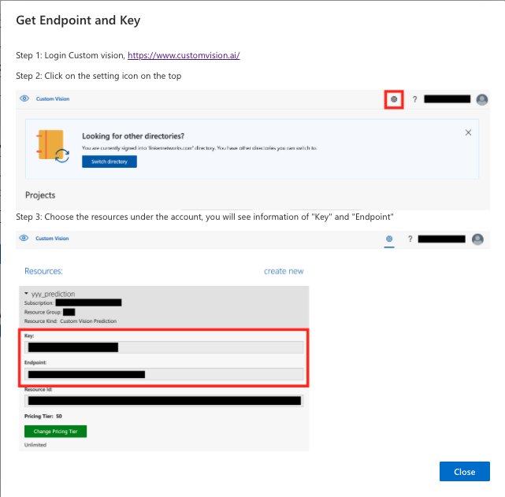
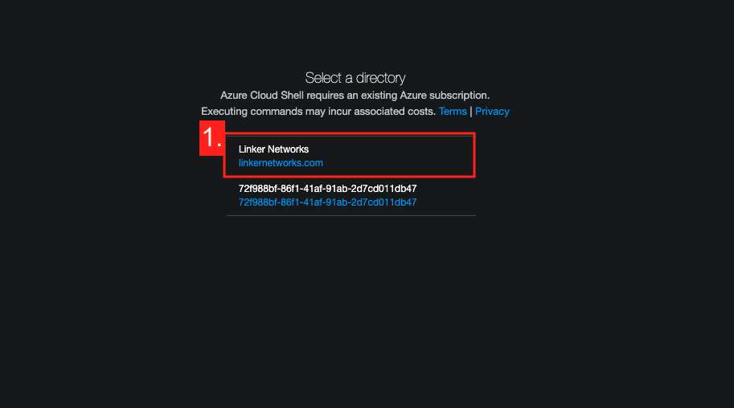
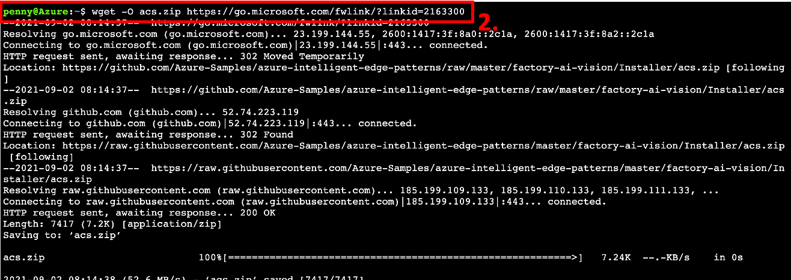

# Vision on Edge Shell Installer

## Prerequisites

To install the Vision on Edge Solution Accelerator, the following three prerequisites are required:

 1. A Custom Vision Account with key and endpoint.
 See the below link to find your training key [here](https://www.customvision.ai/projects#/settings) and learn more [here](https://azure.microsoft.com/en-us/services/cognitive-services/custom-vision-service/)

 
 
 2. AVA account to get AVA Provision Token. 

 
 
 3. An IoT Hub with edge device

To deploy the solution to an Azure Stack Edge device, your subscription must contain Azure Stack Edge with compute enabled as per [documentaton here](https://docs.microsoft.com/en-us/azure/databox-online/azure-stack-edge-gpu-deploy-configure-compute) or IoT hub Edge device with port 8181 opened. Please follow this [documentation](https://github.com/Azure-Samples/azure-intelligent-edge-patterns/blob/master/factory-ai-vision/Tutorial/CreateIoTEdgeDevice.md) for deployment information

   
## Get Started 

1. Open your browser and paste the link https://shell.azure.com/  to open the shell installer. 
2. You will need a Azure subscription to continue. Choose your Azure account.

3. To download installer (acs.zip) from github by putting the following command `wget -O acs.zip https://go.microsoft.com/fwlink/?linkid=2163300`

4. Unzip it `unzip -o acs.zip`. 

5. Execute the installer `bash factory-ai-vision-install.sh`

6. It will check the az command and check if it requires any installing/updating the IoT extension
 You would be asked:
 Would you like to use an existing Custom Vision Service? (y or n):  y 
 To learn more about Custom Vision Service, please refer the linke [here](https://azure.microsoft.com/en-us/services/cognitive-services/custom-vision-service/)
 If you choose “yes”, you will asked to input your training endpoint and key.
 Please enter your Custom Vision endpoint: xxxxxx
 Please enter your Custom Vision Key: xxxxxx
  You can find your training key [here](https://www.customvision.ai/projects#/setting)

7. If you choose not to use an existing account, please go ahead and create a new one using the instruction

8. Once you input custom vision account information. You will be asked whether to use Azure Video Analytics (y), and then please enter your AVA Provision Token. 
 Do you want to install with Azure Video Analytics? (y or n):y
  Please enter your AVA Provision Token

9. There will be a list of IoT Hubs resources listed. Please choose your desired/appropriate resource.
 It will then show a list of devices in your account, and choose the device to install your vision on edge. 

10. Choose cpu to correspond to Edge device.
  If choosing vpu, please click [here](https://docs.openvino.ai/latest/openvino_docs_install_guides_installing_openvino_linux_ivad_vpu.html#doxid-openvino-docs-install-guides-installing-openvino-linux-ivad-vpu) and [here](https://docs.openvino.ai/2021.4/openvino_docs_install_guides_installing_openvino_docker_linux.html#build_docker_image_for_intel_vision_accelerator_design_with_intel_movidius_vpus) for more information.

11. The installation will be scheduled to complete.
  You can check the deployment status on the [Azure portal](https://portal.azure.com/#home)
 It takes to get everything deployed and till then the IOT console will temporarily show error, please wait. 

12. After installation is completed, please check your device to get the IP address,
  Properties-> Networking -> Public IP address
  Open your browser, connect to http://YOUR_IP:8181
e.g.  connect to http://168.63.246.174:8181

13. Check out our tutorials on youtube channel 

- Tutorial 2 - <a href="https://youtu.be/dihAdZTGj-g" target="_blank">Start with prebuilt scenario</a>
- Tutorial 3 - <a href="https://www.youtube.com/watch?v=cCEW6nsd8xQ" target="_blank">Start with creating new project, capture images, tagging images and deploy</a>
- Tutorial 4 - <a href="https://www.youtube.com/watch?v=OxK9feR_T3U" target="_blank">Retraining and improve your model</a>
- Tutorial 5 - <a href="https://www.youtube.com/watch?v=Bv7wxfFEdtI" target="_blank">Advance capabilities setting</a>

