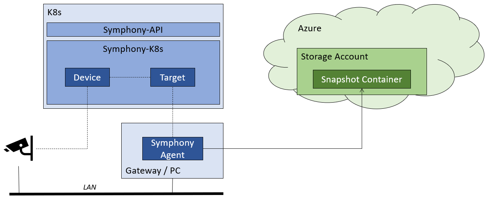

# Symphony Quickstart - Mananging RTSP cameras connected to a gateway

In this scenario, you set up a Symphony control plane on Kubernetes. Then, you deploy a Symphony agent to your PC and register your PC as a ```Target``` on Symphony. In addition, you’ll register a RTSP camera as a ```Device``` and associate the ```Device``` with the ```Target```. 

You also set up an Azure Storage account that holds camera snapshots. Once the agent starts, it starts capturing camera snapshots and uploads then to the storage account. You can then query the latest snapshot URL through the ```Device``` object state.



## 0. Prerequisites

* [**Helm 3**](https://helm.sh/)
* [**kubectl**](https://kubernetes.io/docs/reference/kubectl/kubectl/): Configured with the Kubernetes cluster you want to use as the default context.
* [**Azure CLI**](https://docs.microsoft.com/en-us/cli/azure/)
* **Azure Storage Account** and **Azure Service Principal** (See instructions [here](../agent/agent.md).)
* An **RTSP camera** on your local network. If the camera is password protected, you need the corresponding user name and password. 
* **Symphony Agent** binary (See [here](../build_deployment/build.md) for build instructions.)

## 1. Deploy Symphony using Helm

If you already have the ```symphony-k8s``` repository cloned:

```bash
cd symphony-k8s/helm
helm install symphony ./symphony
```

Or, if you have access to the ```symphonyk8s.azurecr.io``` container registry (contact hbai@microsoft.com for access), use Helm to deploy Symphony:

```bash
# login as necessary. Note that once the repo is turned public, no authentication is needed.
export HELM_EXPERIMENTAL_OCI=1
USER_NAME="00000000-0000-0000-0000-000000000000"
PASSWORD=$(az acr login --name symphonyk8s --expose-token --output tsv --query accessToken)
helm registry login symphonyk8s.azurecr.io   --username $USER_NAME --password $PASSWORD

# install using Helm chart
helm install symphony oci://symphonyk8s.azurecr.io/helm/symphony --version 0.1.21
```

## 2. Create the ```Camera``` Object

To manually register your camera as a Symphony ```Device```, create a new ```Device``` object using ```kubectl```. You need to set the ```ip``` property, the ```user``` property as well as the ```password``` property to match with your camera settings. Note that the camera is labeled to be connected to a ```gateway-1``` target, which you create in the next section.

```bash
apiVersion: fabric.symphony/v1
kind: Device
metadata:
  name: camera-1
  labels:
    gateway-1: "true"    
spec:
  properties:
    ip: "<RTSP camera IP>"    
    user: "<RTSP camera user>"
    password: "<RTSP camera password>"
```

Once you save the above YAML file (say as ```camera-1.yaml```), you can apply it with ```kubectl```:

```bash
kubectl create -f ./camera-1.yaml
````
> [!NOTE]
> You can find a sample of this file under the ```symphony-k8s/samples/device-management``` folder.

## 2. Create the ```Target``` object

Next, you create a ```Target``` object reresending the gateway device. The association between the gateway and the camera is done through Kubernetes [selectors](https://kubernetes.io/docs/concepts/overview/working-with-objects/labels/). 

```bash
  apiVersion: fabric.symphony/v1
  kind: Target
  metadata:
    name: gateway-1
  spec:
    properties:
      cpu: x64
      acceleration: "Nvidia dGPU"
      os: "Ubuntu 20.04"
```

Save the above YAML as ```gateway-1.yaml``` and apply it using ```kubectl```:

```bash
kubectl create -f ./gateway-1.yaml
```

> [!NOTE]
> You can find a sample of this file under the ```symphony-k8s/samples/device-management``` folder.

## 3. Launch the Symphony Agent as a process

To run the Symphony Agent as a process, you need to set required environment variables first, and then launch the agent.

To get the Symphony API address, use kubectl:

```bash
kubectl get svc symphony-service-ext
```
You'll need the ```EXTENRAL-IP``` field, as shown in the following sample:
```bash
NAME                   TYPE           CLUSTER-IP    EXTERNAL-IP    PORT(S)          AGE
symphony-service-ext   LoadBalancer   10.0.251.58   20.40.25.217   8080:31924/TCP   41m
```

Then, configure your environment variables:

```bash
export AZURE_CLIENT_ID=<service principal app id>
export AZURE_TENANT_ID=<service principal tenant id>
export AZURE_CLIENT_SECRET=<service principal client secret>
export STORAGE_ACCOUNT=<storage account name>
export STORAGE_CONTAINER=<storage container name>
export SYMPHONY_URL=http://<symphony API address>:8080/v1alpha2/agent/references # point to your local Symphony API endpoint, or the public Symphony API service endpoint on K8s
export TARGET_NAME=<target name> #the name of the Target object representing the current compute device
```
Now, you can launch the Agent:

```bash
./symphony-agent -c ./symphony-agent.json -l Debug
```

## 4. Verify the results

Once the Agent is running, you should see a snapshot image saved in your storage container (named ```camera-1-snapshot.jpg``` in this case). Now, you can get the latest snapshot URL from device status:

```bash
kubectl get device camera-1 -o yaml
```

Observe the snapshot URL:

```bash
apiVersion: fabric.symphony/v1
kind: Device
metadata:
  ...
spec:
  ...
status:
  properties:
    snapshot: https://voestore.blob.core.windows.net/snapshots/camera-1-snapshot.jpg
            # ^--- snapshot URL is here
```

# Next step

* [Symphony Quickstart: Deploying a simulated temperature sensor solution to an Azure IoT Edge device](/docs/api/quick_start/deploy_solution_to_azure_iot_edge.md)

