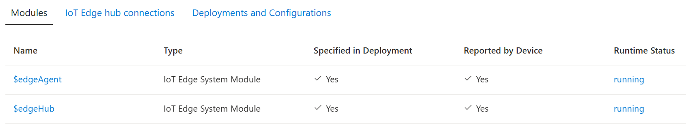

# KAN Troubleshooting Guide

Troubleshooting intelligent edge solutions can be challenging due to their complex nature with multiple interdependent components. This guide provides a systematic approach to identifying and resolving issues when the inference results deviate from expectations, by evaluating various stages of the AI pipeline.

The KAN platform accommodates two distinct types of computing devices - IoT Edge devices and Kubernetes clusters as devices. For efficient troubleshooting, please refer to the appropriate section that corresponds to your device type.

## IoT Edge Compute Device

### 1. Is your Deployment stuck at the "deploying" state?

1. On the Deployment page of the KAN portal, check the status of the deployment tile.
2. If the tile is stuck in a ```deploying``` state, it typically indicates errors with the corresponding IoT Edge module.In this case, continue with steps 2 and 3 to identify the cause of the issue.
3. If the deployment tile is in a ```running``` state, proceed to step 4.

### 2. Is your IoT Edge device working?
To verify the proper functioning of your IoT Edge device, including the IoT Edge runtime, follow these steps:

1. Log in to the Azure Portal
2. Navigate to the IoT Hub associated with your IoT Edge device.
3. In the left panel, click on "IoT Edge" and then select your IoT Edge device from the table on the right.
4. Review the status of the IoT Edge modules, specifically the ```$edgeAgent``` and ```$edgeHub```, which should both be displayed and in a ```running``` state, as shown in the following screenshot:

    

If either of these modules are missing or in an error state, it indicates an improper configuration of your IoT Edge device. Refer to the IoT Edge documentation to resolve any configuration issues before proceeding further.

> **NOTE**: It is important to ensure sufficient memory on your device when working with AI models. As a general guideline, your device should have a minimum of 4GB of memory to support the IoT Edge runtime and AI modules.

### 3. Is your [Instance](../api/object-model/instance.md) object deployed successfully?

> **NOTE**: **Instances** objects are called **Deployments** on Portal.

To verify the proper functioning of your instance module, follow these steps:

1. On the IoT Edge device page in the Azure Portal
2. Check if the instance module, which has a name starting with ```instance-```, is in a ```running``` state.
3. If the module is not in a running state, click on the module name to access the module details page.
4. From the module details page, click on the "Troubleshoot" menu.
5. Review the logs to gather information on any potential issues.

The logs may provide valuable insights and help you determine the cause of any deviations from expected results.

### 4. Is your camera or video feed working?

To verify the functionality of the video feed, follow these steps:

1. Use a standalone video player to open the RTSP stream address.
2. Observe the video output to determine if it is functioning properly.

This will allow you to determine if there are any issues with the video feed, and help you in troubleshooting the solution.

### 5. Does your AI SKill have a filter with high threshold?

If you are experiencing missing inferences, and your AI Skill includes a filter with a high confidence threshold, consider the following steps:

1. Reduce the confidence threshold to allow for lower confidence detections.
2. Alternatively, bypass the filter node entirely.
3. Observe the inferences after allowing several minutes for the IoT Edge modules to redeploy.

Lowering the confidence threshold or bypassing the filter node may allow for previously filtered out detections to come through and provide the desired results.

<hr/>

## Kubernetes Compute Device

> **NOTE**: Please note that the following instructions assume familiarity with ```kubectl```.

### 1. Is your Deployment stuck at the "deploying" state?

1. On the Deployment page of the KAN portal, check the status of the deployment tile.
2. If the tile is stuck in a ```deploying``` state, it typically indicates errors with the corresponding IoT Edge module.In this case, continue with steps 2 and 3 to identify the cause of the issue.
3. If the deployment tile is in a ```running``` state, proceed to step 4.

### 2. Is your Kubernetes compute device working?

To verify the functionality of the SYMPHONY agent, follow these steps:

1. Check the status of the SYMPHONY agent by running the following command:
   ```bash
   kubectl get pods | grep symphony-agent
   ```
2. The command should return a pod in the ```Running``` state. If no pods are returned, your Kubernetes compute device has not been properly configured.
3. If the pod is in a failed state, examine the pod log using this command:
   ```bash
   kubectl logs <name of the symphony-agent pod>
   ```

These steps will help you determine if the SYMPHONY agent is running properly and provide insight into any potential issues.

> **NOTE**: It is important to ensure sufficient memory on your device when working with AI models. As a general guideline, your device should have a minimum of 4GB of memory to support the IoT Edge runtime and AI modules.

### 3. Is your [Instance](../api/object-model/instance.md) object deployed successfully?

> **NOTE**: **Instances** objects are called **Deployments** on Portal.

To validate the correct operation of your instance object, follow these steps:

1. Run this command:
   ```bash
   kubectl get instances
   ```
2. Examine the status of the instance. If it is not in an ```OK``` state, locate its corresponding pod with the following command:
   ```bash
   kubectl get pods --all-namspaces | grep instance-
   ```
3. Match the pod name to the instance name to identify the correct pod. If the pod is in a failed state, examine its log using the following command:
   ```bash
   kubectl logs <pod name>
    ```

The logs may provide valuable insights and help you determine the cause of any deviations from expected results.

### 4. Is your camera or video feed working?

To verify the functionality of the video feed, follow these steps:

1. Use a standalone video player to open the RTSP stream address.
2. Observe the video output to determine if it is functioning properly.

This will allow you to determine if there are any issues with the video feed, and help you in troubleshooting the solution.

### 5. Does your AI SKill have a filter with high threshold?

If you are experiencing missing inferences, and your AI Skill includes a filter with a high confidence threshold, consider the following steps:

1. Reduce the confidence threshold to allow for lower confidence detections.
2. Alternatively, bypass the filter node entirely.
3. Observe the inferences after allowing several minutes for the IoT Edge modules to redeploy.

Lowering the confidence threshold or bypassing the filter node may allow for previously filtered out detections to come through and provide the desired results.
