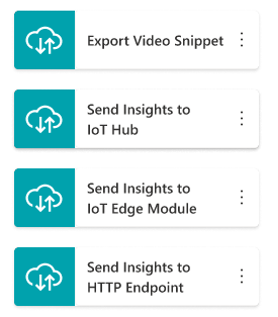
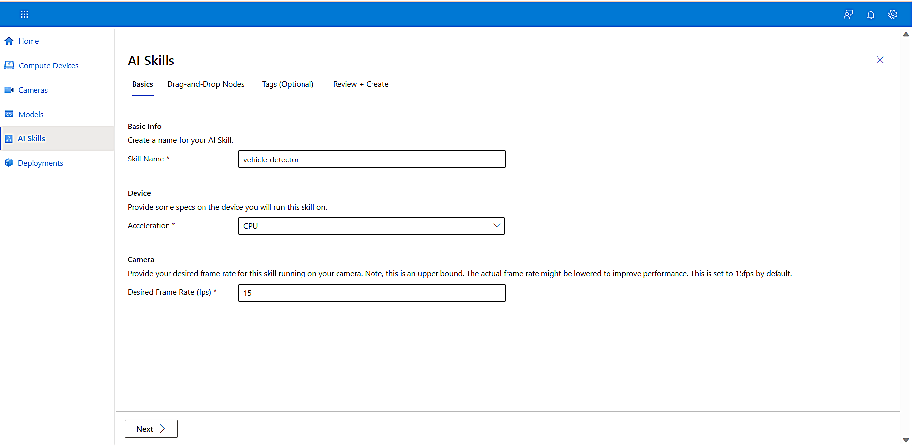
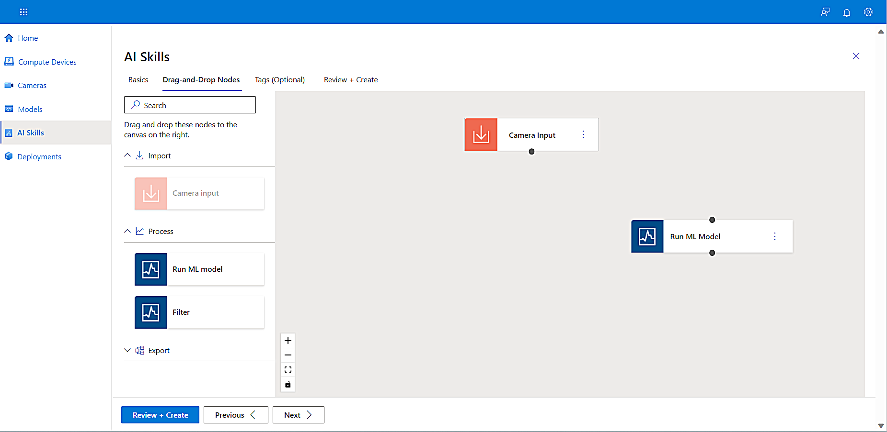
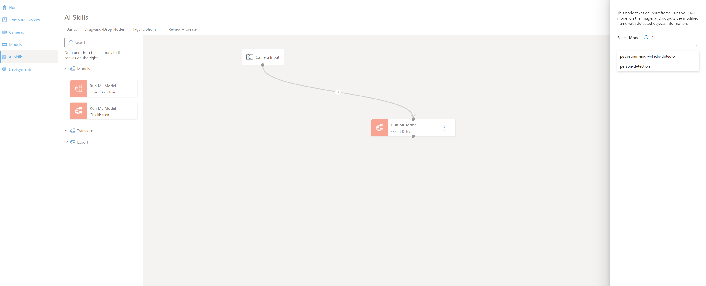
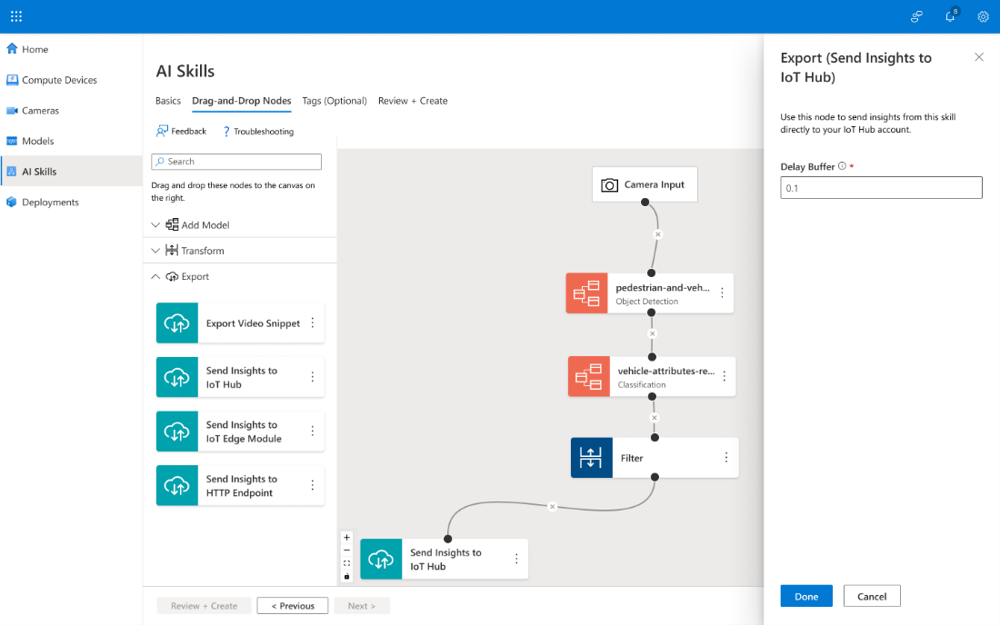
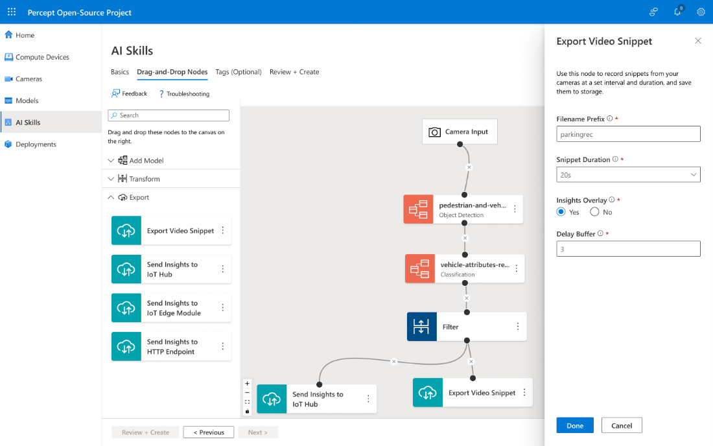
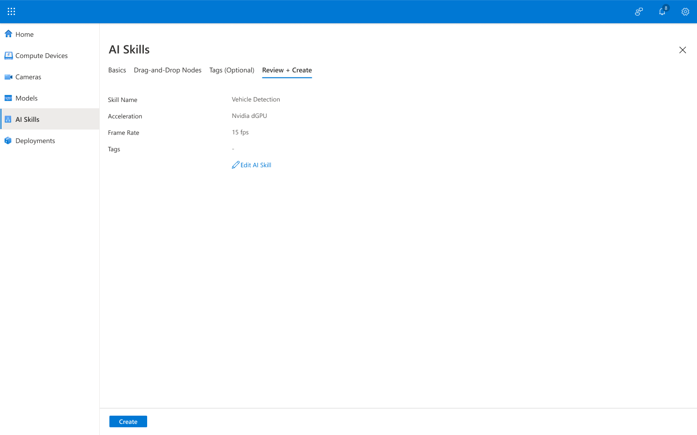

# Create a complex AI skill with Azure Percept Open-Source Portal

## Overview

Azure Percept Open-Source skills are deployable packages to Edge devices. These packages are a cascade of stages or *nodes* where the video feed is consumed by an Edge device, inferences are calculated, results are filtered, and results and video clips are exported for further business logic processing or storage. 

There are three groups of nodes that comprise AI skills:

1.  **Model** – All the machine learning models available for detection and classification.

    Models may be selected from the [Model Zoo](https://modelzoo.co/), customized from an existing Azure Custom Vision (ACV) project, or a developer’s own external model (Bring Your Own Model, BYOM).

2.  **Transform** – Transforms and enriches the data; for instance, it can filter classes to the one we want to implement for our scenario. 

    A filter may also only forward inference results that meet confidence level estimates. 

    

3.  **Export** - Helps you export raw inference data and actionable insights to a broad range of locations in the cloud. Locally at the Edge, you'll be able to create your own custom module that will allow you to integrate with other applications and systems in your customer's environment. Here are few nodes that we support today:

    

An AI skill allows the result of one model to feed into the next. For example, the first model may detect vehicles and pass them to a model that classifies them by type: car, truck, or bus. Based on user defined logic, these insights and video snippets are sent to an IoT Hub.

AI skills are built in four steps:

1.  Supplying basic information for the AI skill.
2.  Adding and configuring nodes.
3.  Adding tags. (**Optional**)
4.  Review and creation.

In this document, we will build an AI skill that detects vehicles and then classifies the vehicles by type.

## Build an AI skill

1.  From the left navigation blades, select **AI Skills**, and then select **Create AI Skill**.

    

    The **AI Skills** page opens, displaying the **Basics** tab.

    

2.  Complete the following required information in the **Basics** tab:

    1.  In the **Skill Name** field, add a name.

    2.  In the **Acceleration** field, select the acceleration type. If you previously defined an acceleration on a compute device that will run this skill, ensure the types match.

    3.  In the **Desired Frame Rate** field, select a frames per second (fps) value. This is an upper bound and may change based on performance requirements.

    

3.  To advance to the **Drag-and-Drop Nodes** tab, select **Drag-and-Drop Nodes** or **Next**.

    

    In this tab on the left side, you see a tree of nodes to add model, transform and export nodes. Each type of node is required in a skill. Each node has an input connection on the top and an output connection on the bottom. The ellipsis in each node allows editing of the node’s properties or deletion of the node. These are dragged onto the canvas, connected with other nodes, and then configured depending on the type of node. The first node is a model to make inferences on the camera feed.

4.  Select **Add Model.**

    

5.  From the **Add Model** list, drag an object detection model into the outline, as shown in the screenshot below.

    

6.  Drag the **Connector** from the **Camera Input** to the model.

    

    When a model is connected, the **Object Detection Model** properties box appears on the right of the window. Models you have previously specified appear as options.

7.  Open the **Select Model** dropdown list.

    

8.  Select **pedestrian-and-vehicle-detector (Model Zoo)** per our use case. The tag for the object(s) to be detected appears.

    
        

9.  Select **Done.**

    Now that we can detect vehicles and pedestrians, let’s add another model to classify what sort of vehicle it is. The vehicle classification model is already in the model zoo.

## Add a model to classify type of vehicle

1.  Drag the classification model onto the canvas.
2.  Connect it the same way you did with the detection node.
3.  In the **Classification Model** information box, select **vehicle-attributes-recognition** from the **Select Model** dropdown list. 

    The tag for the object(s) to be detected appears.

    

4.  Select **Done.**

To recap, the AI skill at this point detects a person and passes the inference results (x,y coordinates of the bounding box(es) in the image to the helmet recognition node. The output of the recognition node is now available for input to a transform node.

## Add a Transform node

1.  From the left navigation, select the **Transform** node dropdown list. 

    Transform nodes allow you to filter the classes you want the skill to work on. If you have a model with numerous classes, you can create a subset of the data based on the object and the confidence threshold.

2.  Drag the **Filter** node onto the canvas and connect it the same way you did with the detection node.

    

3.  In the **Filter Transform**, enter the names of the objects detected by your skill in the **Objects** field.
4.  In the **Confidence Threshold** field, enter a number for the minimum **confidence threshold.** 

    The threshold you select is determined by your use case. For more information, visit [Classification Algorithms parameters in Azure ML](https://social.technet.microsoft.com/wiki/contents/articles/33879.classification-algorithms-parameters-in-azure-ml.aspx).
    
5.  Select **Done**.

## Add an Export node

The export nodes send your actionable insights and video snippets to a broad range of locations in the cloud: your IoT hub, IoT module, or an HTTP endpoint. Locally at the Edge, you'll be able to create your own custom module that will allow you to integrate with other applications and systems in your customer's environment. 

In the next section, we'll start with an export to your IoT hub.

## Send the insights to an IoT Hub

1.  From the **Node/Export** accordion, select **Send Insights to IoT Hub** and drag it onto the canvas to connect to the **Filter** node.
2.  In the **Export (Send Insights to IoT Hub)** information box, enter **0.1** seconds into the **Delay Buffer** field.

    

3.  Select **Done**.

## Export a Video Snippet

1.  From the **Node/Export** dropdown list, select **Export Video Snippet** and drag it onto the canvas to connect to the **Filter** node.
2.  In the information box, enter a meaningful name that you can find in storage in the **Filename Prefix** field.
3.  In the **Snippet Duration** field, choose 10 or 20 seconds.
4.  Select **Yes** in the **Insights Overlay** field to include the bounding boxes and confidence level for each box.
5.  The **Delay Buffer** field defines how frequently a snippet is stored.
6.  Select **Done**.

## Validate the inputs

1.  Select **Review + Create** to validate all the inputs. 
2.  If you want to make changes, select **Edit AI skill**.

    

3.  Select **Create**.

    

You have now completed creating your AI skill library. All your configured skills are stored in this library.

## Edit or delete an AI skill

1.  To edit or delete the AI skill, select the ellipses **(...)** in the upper right of the skill tile.
2.  To edit the tile, select **Edit AI Skill**, and make your changes to the skill.

    To delete the tile, select **Delete**.

    

Your AI skill is now ready to be added to a deployment.

## Next steps

Now that you understand what AI skills are and how to use models to build, transform, and export them, your next step is to go the **Deployments page** and connect your AI skills to your target device.

We also recommend the following tutorials to increase your experience:

- [Tutorial: Create an Edge AI solution with Azure Percept Open-Source Project using a prebuilt model](/docs/tutorial/Tutorial-Create-an-Edge-AI-solution-with-Azure-Percept-Open-Source-Project.md)

- [Tutorial: Create a complex AI skill with Azure Percept Open-Source Project](/docs/tutorial/Create-a-complex-AI-skill.md)

- [Tutorial: Create a custom model with Azure Percept Open-Source Project](/docs/tutorial/Create-a-custom-model.md)
