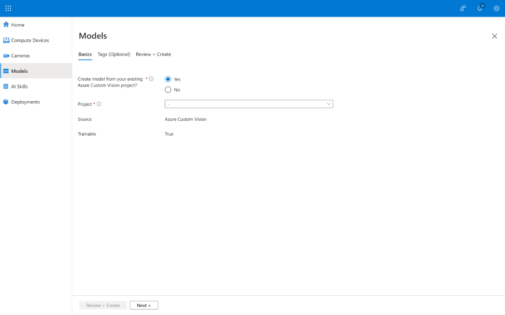
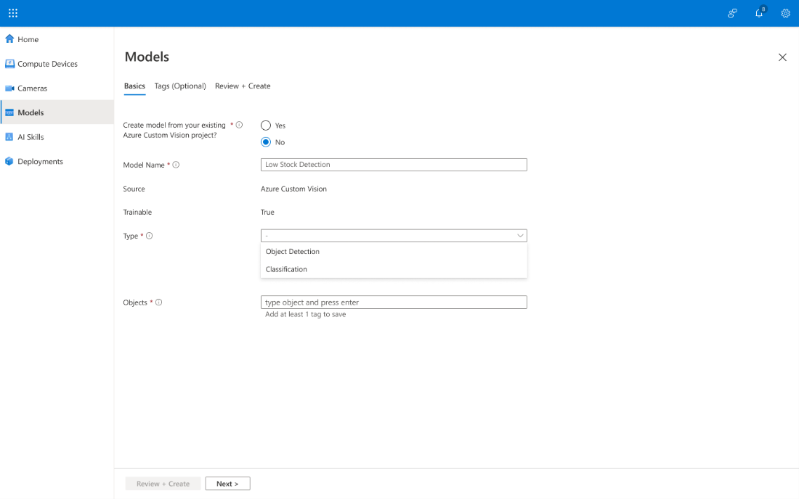
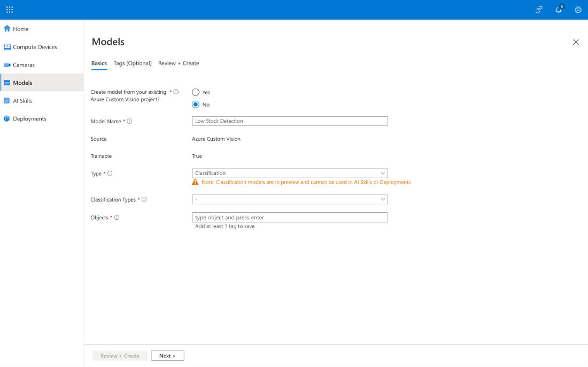
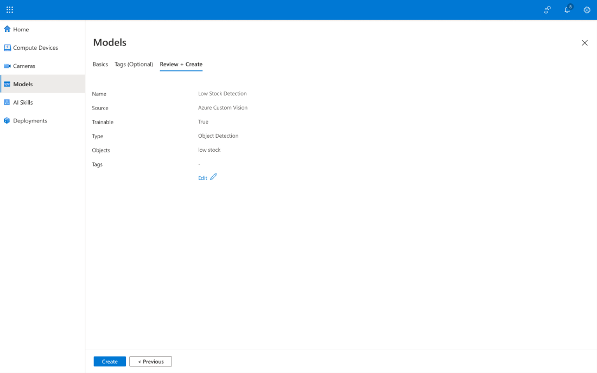
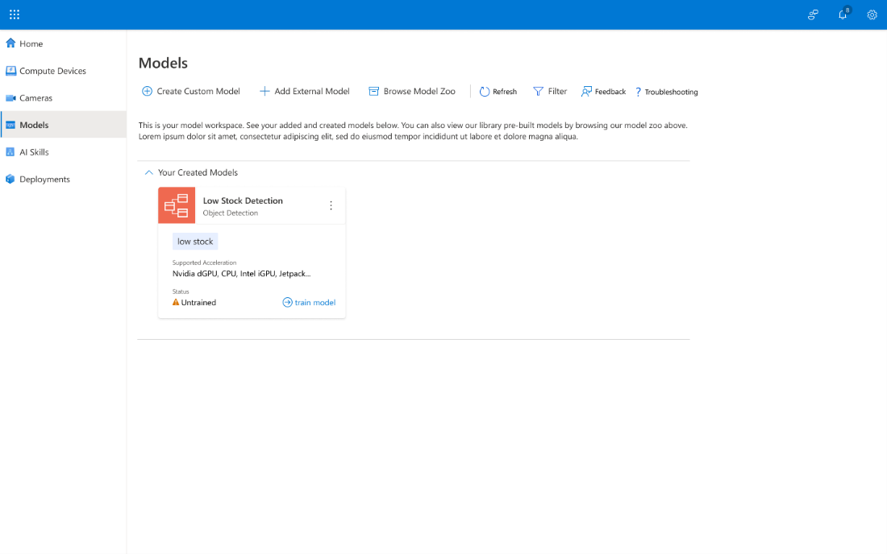
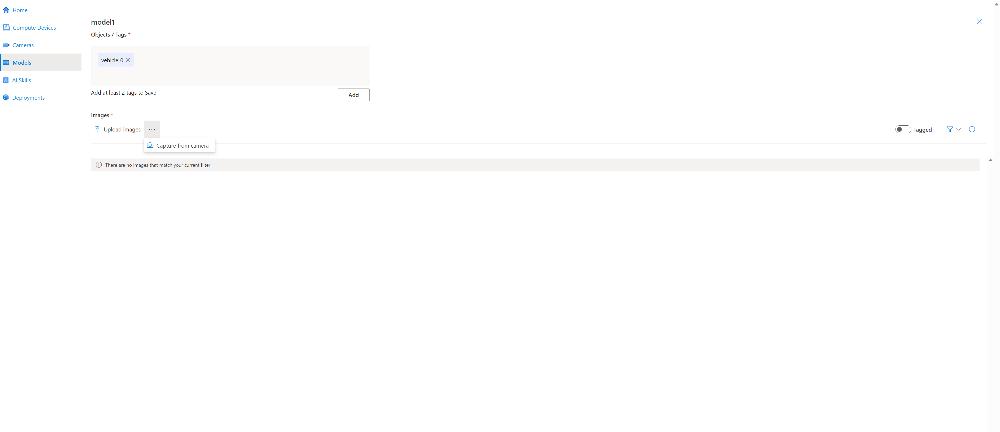
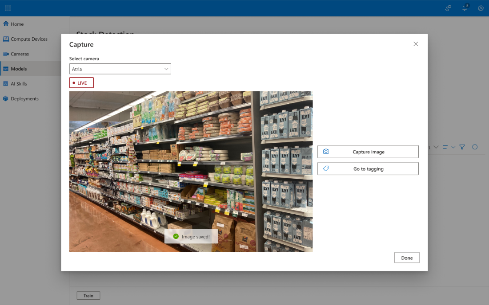
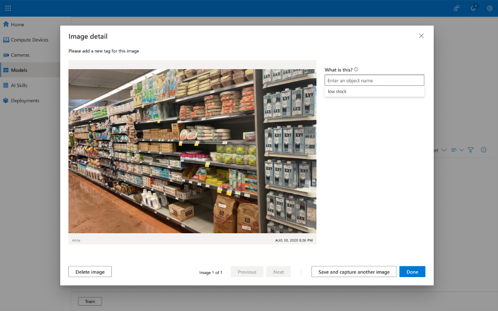
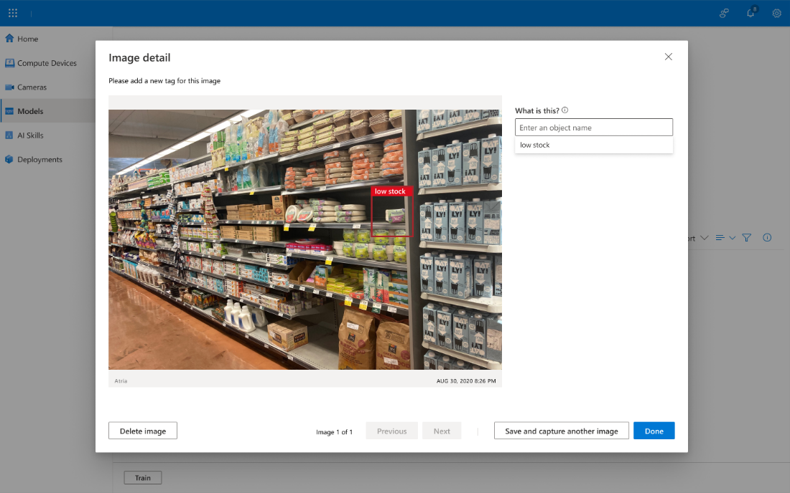

# Create a custom model with Azure Percept Open-Source Project

## Overview

Models are machine learning (ML) algorithms for object identification or classification. Vision models are based on neural networks, specifically convolutional neural nets. These models are built in layers with each layer building features of the objects to be detected or classified.

In this article, we’ll guide you through the process of adding and training custom models. You can create your own custom model easily by supplying any 15 images based on your customer's use case, labeling them via a interface, and training based on our base models.

For our example use case, we will add a custom model that detects when a store has low stock levels for its products based on images of the store shelves. This model provides real time evaluation that can be used to trigger business logic. An example is [just-in-time supply chains](https://www.liveabout.com/just-in-time-jit-2221262#:\~:text=A%20just%2Din%2Dtime%20supply%20chain%20is%20one%20that%20moves%20synchronized%20with%20the%20subsequent%20operations) that save significant costs on excess stock and storage overhead.

## Add a model in POSS

The **Model** blade on the left navigation displays two options for adding models to the workspace: **Create Custom Model** or **Browse Model Zoo**.

1.  From the left navigation, select **Models**.
2.  To add a prebuilt model, select **Create Custom Model**.
3.  To reuse an existing [Azure Custom Vision (ACV) mode](https://docs.microsoft.com/en-us/azure/cognitive-services/custom-vision-service/overview), or to create one from scratch, select **Create Custom Model**.

    When prompted, choose whether the model is based on an existing model or not.

4.  If you select **Yes,** a dropdown list appears allowing you to choose from available models.

    

    If you select **No**, you can create your own model. Then enter the **Model Name**, **Type**, and **Objects**.

> [!NOTE] If you select **Classification** from the **Type** box, note that Classification models are in preview and you can't use them in AI Skills and Descriptions.
> 

6.  Select **Objects** and enter at least one tag for the detection model to identify. Objects should be in quotes and separated by commas.

    

    These tags will be used later when you’re training the model to identify and label objects from the camera feeds.

7.  Select **Review + Create** or, to move to the **Tags** tab, select **Next**.

8.  When you've finished adding tags, select **Review + Create** to move to the next page.

9.  Select **Review + Create** to confirm all the inputs. If you want to make any changes, select **Edit**.

10.  To add the model, select **Create**.

## Model training

Training the model consists of identifying the objects to be detected or classified and then providing tagged images where the object appears. This [*supervised learning*](https://docs.microsoft.com/en-us/learn/modules/introduction-to-classical-machine-learning/) allows the model’s layers to build features layer by layer. As with any neural network, more data is correlated with a more accurate model.

1.  To train the model, **Model Properties** box, select **Train Model**.

2.  Add any additional objects or tags, and then press **Enter**.

3.  After adding objects, select **Save.**

    Now that you have identified the objects, the next step is to enter input so the model can find objects in a camera feed.

4.  To start the tagging process, select **Capture from camera** and then select a camera from the **Select Camera** dropdown list.

5.  Select **Capture Image.**

6.  Select **Go to Tagging**.

7.  Tags you have previously identified appear as options. Select **Low stock**. The **Low Stock** tag represents those areas of the image with little or no stock.

8.  Using the mouse, draw a box around an area of the image representing low stock.   
    The best practice is to include as much of the object as possible.

9.  To see the tagged image library, select **Done**.

    

    The model requires at least fifteen images for training. More images will improve the model’s performance. You can continue to improve the model over time by adding more images and tagging them. Note that the **Tagged** slider turns blue to reflect the status of the image.

10.  To add images, select **Capture from camera**.

11.  Now that there are enough tagged images, select **Train.** It may take time to train the model.

When **Successfully trained Model!** displays, the model is ready to be added to AI Skills.

## Next steps

Now that you understand what models are and how to add them from your model gallery, your next step is to go to the **AI Skills** page to connect your models in a cascade which can chain models and business logic together.

We also recommend the following tutorials to increase your experience:

- [Tutorial: Create an Edge AI solution with Azure Percept Open-Source Project using a prebuilt model](/docs/tutorial/Tutorial-Create-an-Edge-AI-solution-with-Azure-Percept-Open-Source-Project.md)

- [Tutorial: Create a complex AI skill with Azure Percept Open-Source Project](/docs/tutorial/Create-a-complex-AI-skill.md)

- [Tutorial: Create a custom model with Azure Percept Open-Source Project](/docs/tutorial/Create-a-custom-model.md)
