# How-to bring your own model (BYOM)

Bringing your own model allows you to use your models in the POSS environment, either by themselves or in concert with other models. This flexibility enables both quick prototyping and building production pipelines. BYOM brings a plug-and-play capability found nowhere else.

## Prerequisites

-   An ML model in [ONNX](https://onnx.ai/) format. ONNX supports many frameworks you may see [here](https://onnx.ai/supported-tools.html#buildModel). If you must convert to the ONNX format, this repository provides the [tutorials](https://github.com/onnx/tutorials).
-   The location of the ONNX model and label files in Azure blob storage.

## Add an External Model

Open the portal URL you received as part of initial [setup](https://github.com/Azure/PerceptOSS/blob/main/docs/tutorial/setup-guide.md).

1.  From the left navigation, select **Models**.

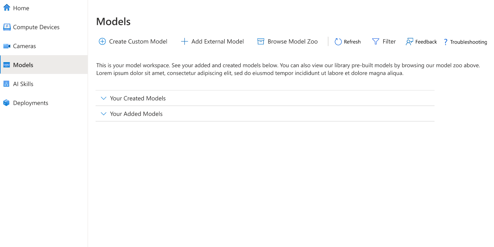

1.  Select **Add External Model.**

This opens a page very similar to adding a **custom model**.

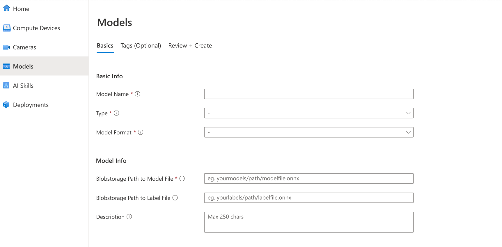

1.  Select **Model Name** and assign your model a meaningful name.
2.  Select **Type** and choose either **detection** or **classification**.

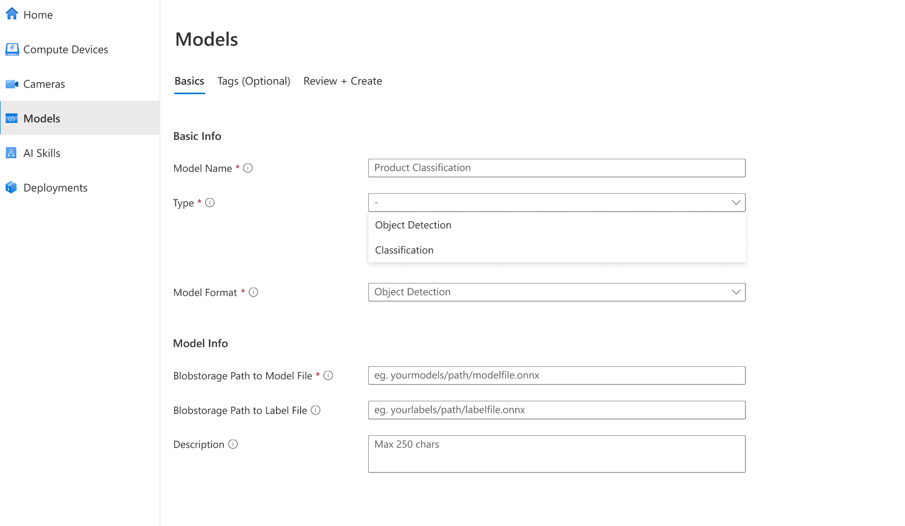

1.  Select **Model Format** and choose **ONNX**.

Later releases will cover a variety of formats.

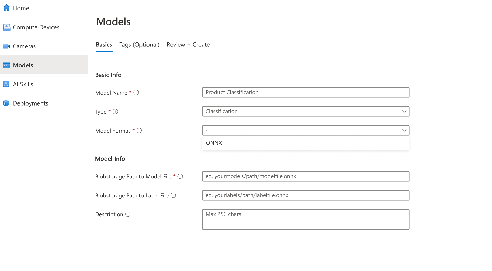

1.  Select the **Blobstorage** path for the model file and fill in the location of the model. Do the same for the label file.
2.  Fill in a meaningful description of the model in the **Description** field.

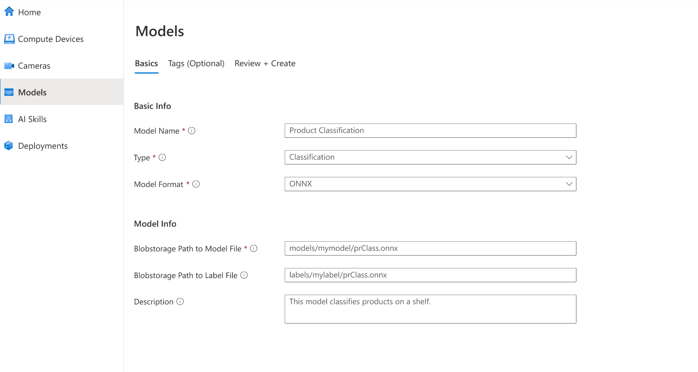

1.  (**Optional**) Select next and assign tags similarly to the way Azure resources are tagged.

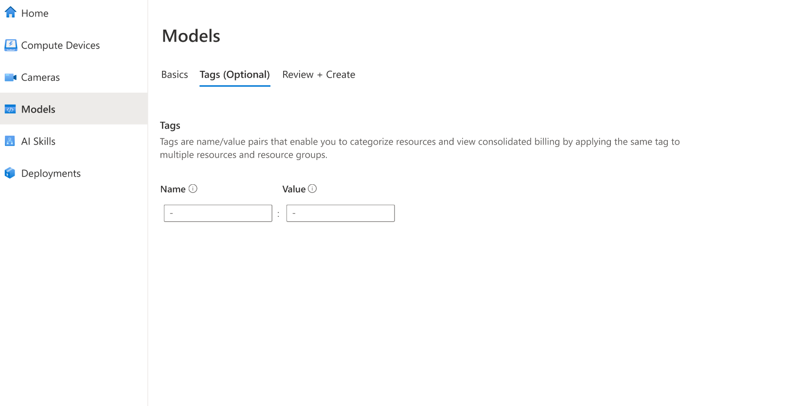

1.  Select **Review and Create.**

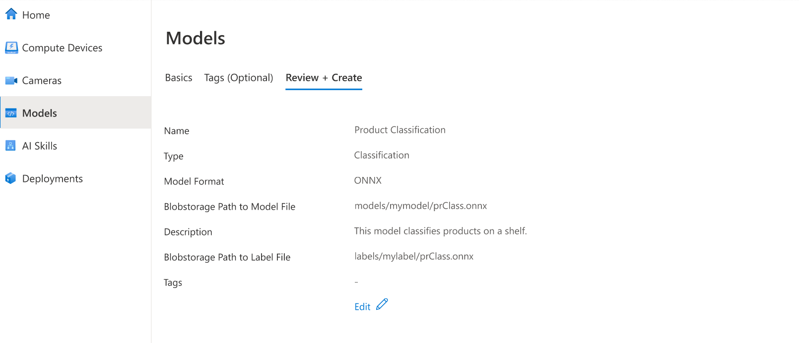

1.  Select **Create** and your model will now appear under **Your Added Models**.

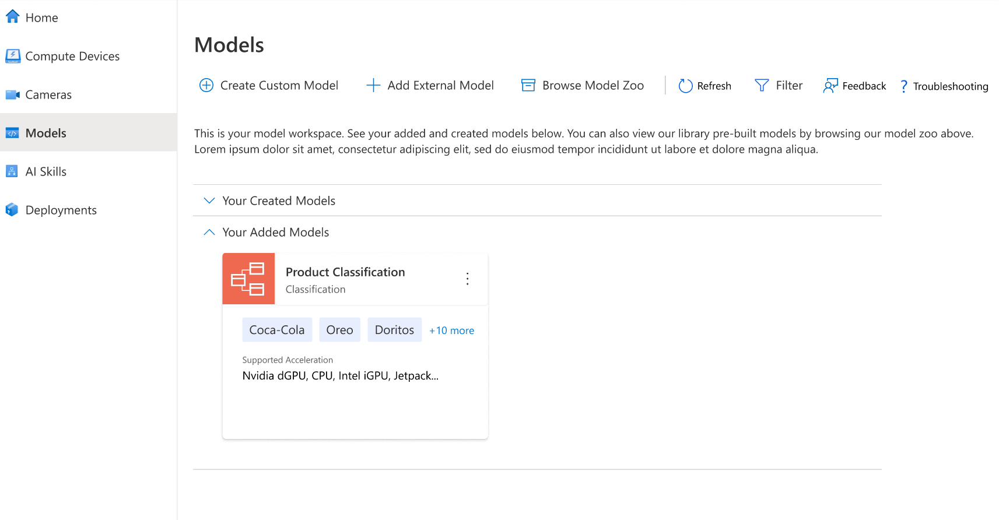

## Next steps

Now that you understand what BYOM is and how to add models through the portal, your next step is:

-   Go to the AI Skills page to connect your models in a cascade which can chain models and business logic together.

 
 

 
 
 
 
 
  

# How-to use gRPC

Users are able to create AI Skills to manage the flow of deployments. The drag-and-drop control is the core method of AI Skill page to compose the flow of an AI Skill. One of the provided nodes is gRPC Custom Processing node, which allows users to host by themselves or let us host on the edge.

## Type 1: Endpoint URL

1.	Click Create AI Skill to start a new AI Skill creation.

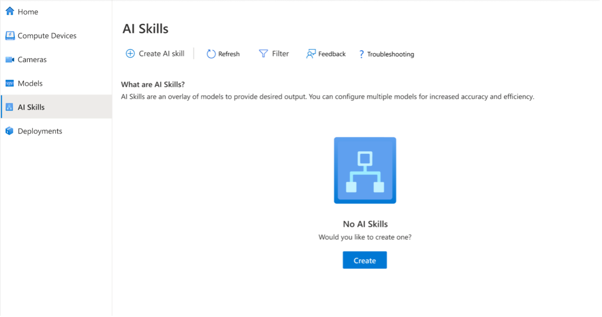

1.	Fill in the necessary information in the Basics tab, which include the Skill Name, Desired Frame Rate (fps), and selecting Device Acceleration, and then click Next to go into Drag-and-Drop Nodes page.

1.	There are three categories on the left side, including Import, Process, and Export. Import now only has the Camera Input node, which already exists on the canvas by default.
2.	Drag the gPRC Custom Processing node and drop on the canvas for gRPC settings.

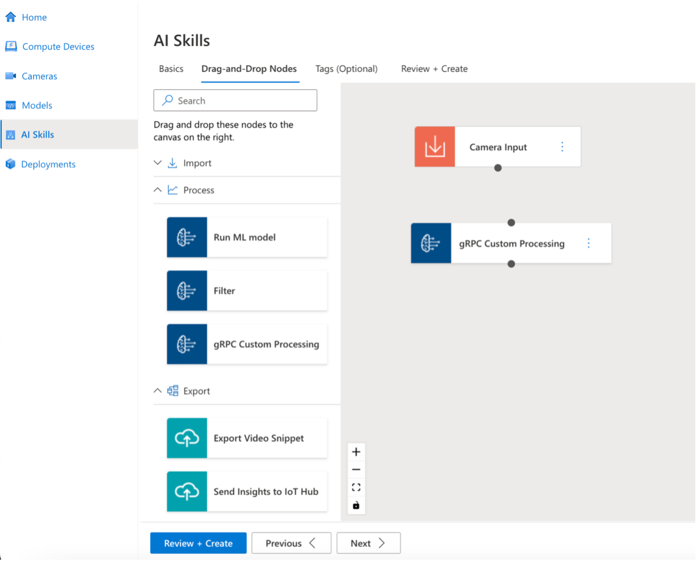

1.	There are two types, including Container and Endpoint URL.
2.	Select Endpoint URL.

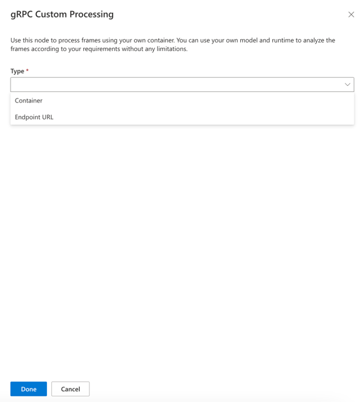

Fill the Endpoint URL in the field, and then click Done to save.

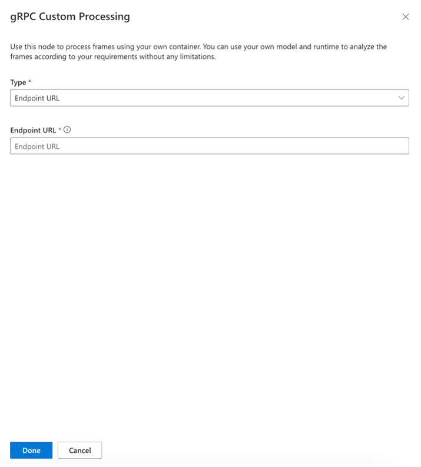

1.	Select one of the Export nodes and drag and drop into the canvas. (Video Snippet, Insights to IoT Hub, and Insights to IoT Edge Module will need Azure resources.) 
2.	Click Next to Tags (Optional) Tab.

1.	(Optional) Assign tags similarly to the way Azure resources are tagged.
2.	Click Review + Create to Review + Create Tab.

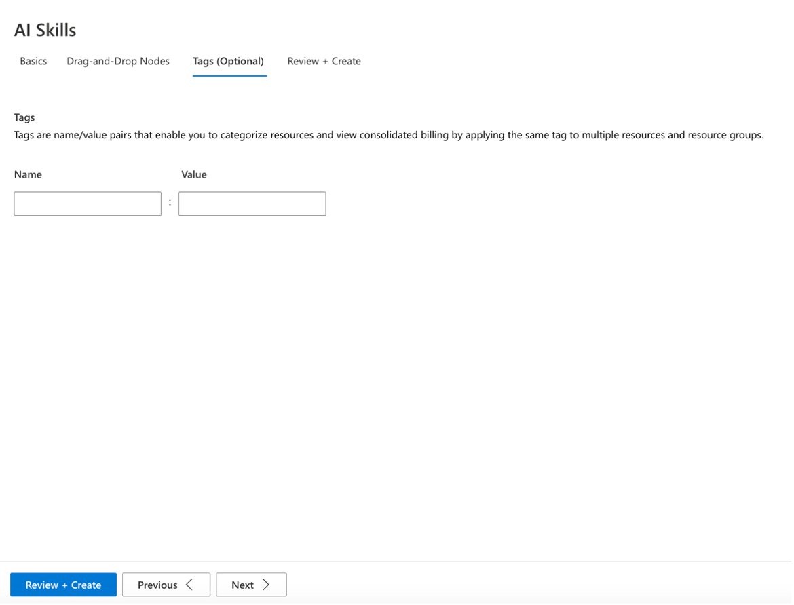

1.	Click Create to complete, and then Your AI Skill will now appear on Al Skills page.

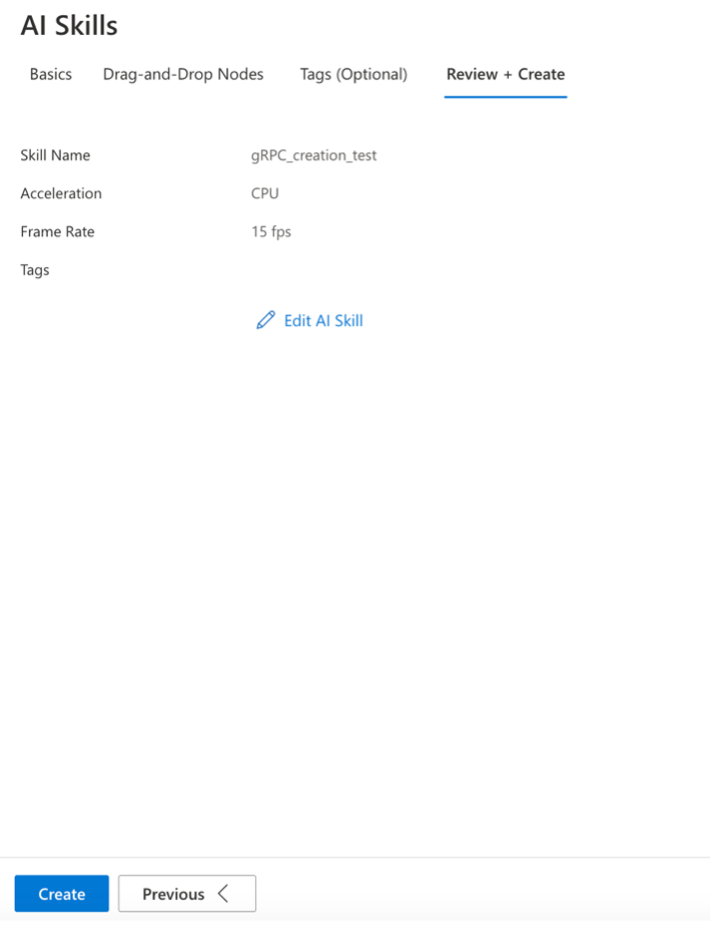

## Type 2: Container

The AI Skill creation is the same as Type 1: Endpoint URL, except for selecting Container type in the gRPC Custom Processing node.

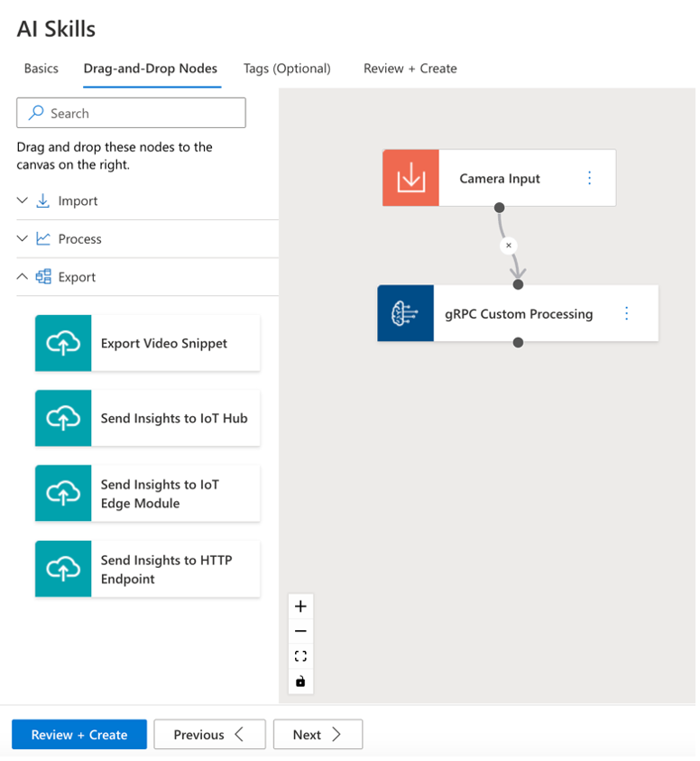

1.	Fill in the information for your container, which includes the Name of container, the Image URL for the path, the Create options (optional) for more detail of container settings, and selecting a Restart policy.
2.	Fill in the information for the endpoint, which includes the Port and Route (optional) that are exited in your container.
3.	If you need, the Environment Variables allows you to fill in the name and the corresponding value.
4.	Finally, set the Constraints for use. Select X64 with Accelerations (Nvidia dGPU, CPU, and Intel iGPU(EFLOW only) ) or select ARM64 with Accelerations (Nvidia Jetson(Jetpack 5) ).
5.	Click Done to save

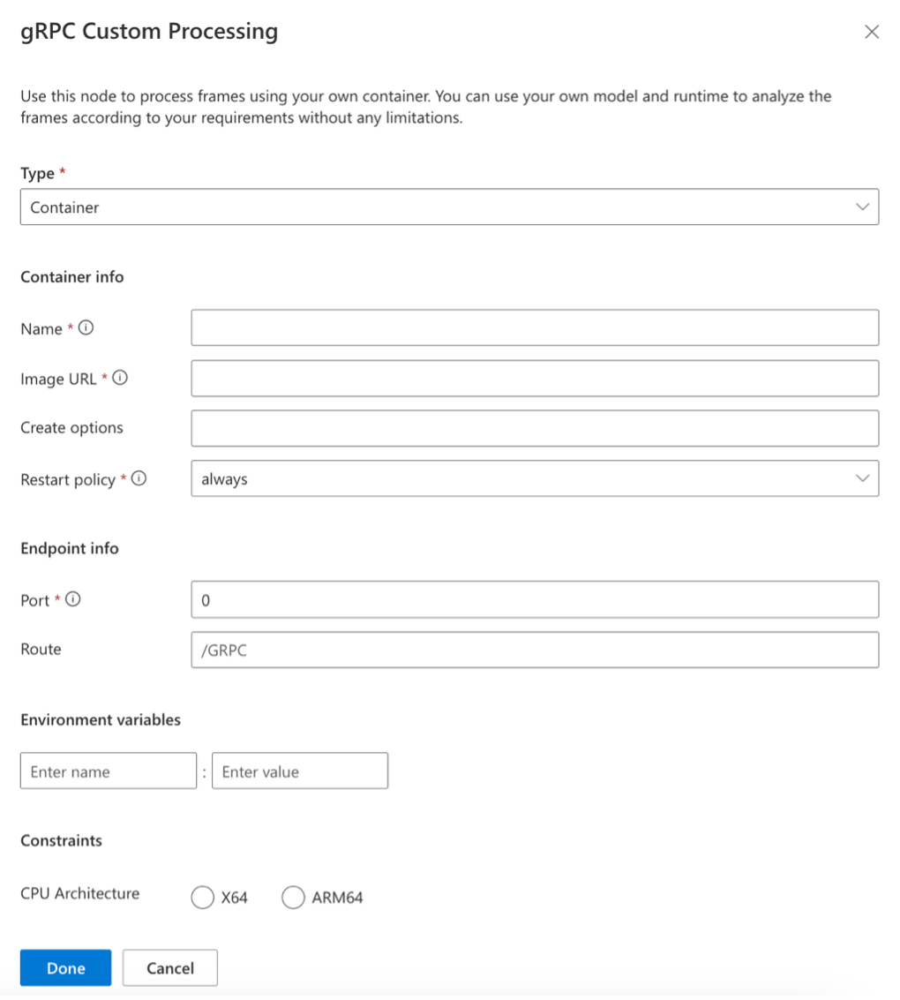

The following step will be the same as Type 1: Endpoint URL.

