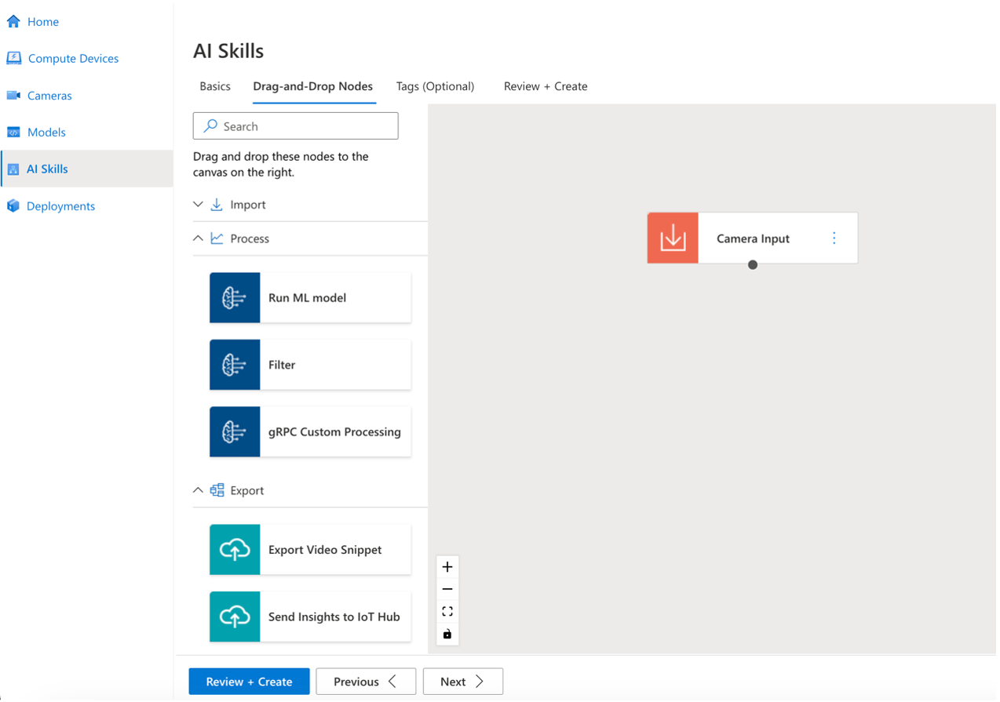

# How-to guide: Bring your own ML model and processing logic for your AI Skill using gRPC Custom Processing (BYOM)

Bringing your model allows you to use your models in the SYMPHONY environment, either by themselves or in concert with other models. This flexibility enables both quick prototyping and building production pipelines. BYOM brings a plug-and-play capability found nowhere else. gRPC Custom Processing node enables you to add your own ML model or custom processing business logic to your AI Skills. gRPC Custom Processing node plays the role of a proxy. It converts the video frames to the specified image type. Then it relays the image over gRPC to another module that runs an AI model (or any other custom code) behind a gRPC endpoint (server). 

# How-to use gRPC Custom Processing

Users can create AI Skills to manage the flow of deployments. The drag-and-drop control is the core method of the AI Skill page to compose the flow of an AI Skill. One of the provided nodes is the gRPC Custom Processing node. The gRPC Custom Processing node takes decoded video frames as the input and relays such frames to a gRPC endpoint exposed by your module. Below we go over how to add your already created gRPC server/endpoint as a node within your AI skill. There are two steps to add your custom logic and ML model: 

* Build your gRPC Endpoint/Server
* Add your gRPC Endpoint/Server to your AI Skill



## Build your gRPC Endpoint/Server
To be able to add your custom model and logic to your AI Skill, you need to build a gPRC endpoint/server that can receive camera frames and respond with appropriate metadata usable by nodes downstream from your gPRC Custom Processing node. To do so you have to use our gPRC contract to build your gRPC server. 

### SYMPHONY Custom Processing node gRPC Contract

The protobuf file for the gRPC contract is [here](../../src/grpc_proto/custom_node.proto)

```
service CustomNodeHandler {
	rpc Handshake(HandshakeRequest) returns (HandshakeResponse) {}
    rpc Process (ProcessRequest) returns (ProcessResponse) {}
}
```


Client (gRPC Custom Processing node) and server (your code) need to follow this protocol to setup the connection before starting sending frames. During the handshaking, client sends a sequence number `seq` and following attributes:
1. instance_id
2. skill_id
3. device_id

And server (your code) should respond an `ack` with following information
1. Image Type for the image that client must send to server latr
2. The format for Request and Response we'll use in Process stage

There're 3 kinds of `ImageType`s: numpy, bmp, and jpeg
```proto
enum ImageType {

    // Use Numpy Bytes
    IMAGE_TYPE_NUMPY = 0;

    // Use BMP
    IMAGE_TYPE_BMP   = 1;

    // Use JPEG
    IMAGE_TYPE_JPEG  = 2;
}
```

There're 2 kinds of Request (client -> server): image and without-image
```proto
enum ProcessRequestType {
    // Client sends the whole Frame to Server
    FRAME_WITH_IMAGE          = 0;

    // Client sends the Frame without Image to Server
    FRAME_WITHOUT_IMAGE       = 1;
}
```

A `Frame` contains many information, the root message is
```proto
message Frame {
    Image        image         = 1;
    InsightsMeta insights_meta = 2;
    Timestamp    timestamp     = 3;
    Roi          roi           = 4;
    string       frame_id      = 5;
    string       datetime      = 6;
}
```
Most of the information (e.g. boundingbox, class, ...) is in `InsightsMeta`. The largest size one is `Image`. Sometimes custom_node might not need the Image itself (e.g. a pure bounding box location-based tracker), that's why we have the without-image option here.

```proto
message Image {
    bytes image_pointer        = 1;
    ImageProperties properties = 2;
}
```
image_pointer contains the image itself, might be numpy, bmp, or jpeg according to what server specified during the handshaking stage. If the server asks for `FRAME_WITHOUT_IMAGE`, then client should just leave `image_pointer` empty


`ProcessResponseType` specify the server's behavior during the Process Stage
```proto
enum ProcessResponseType {
    // Server returns Image to Client
    IMAGE_ONLY = 0;

    // Server returns InsightsMeta to Client
    INSIGHTS_META_ONLY = 1;

    // Server returns Image and InsightsMeta to client
    IMAGE_AND_INSIGHTS_META = 2;

    // Server returns Response with only ack
    EMPTY = 3;
}
```

Following is what server sends back to client
```proto
message ProcessResponse {
    int64 ack = 1;
    Image image = 2;
    InsightsMeta insights_meta = 3;
}
```
1. every kind of response contains `ack`
2. `IMAGE_ONLY`: insights_meta is empty, the reponse contains `image`. the example for this is to build a flip node that only flip the image and send it back to the client. And then client(streaming) will send the new image to the next node
3. `INSIGHTS_META_ONLY`: insights_meta only, e.g. an object detection server should response the bounding boxes, confidence scores, and classes without the image
4. `IMAGE_AND_INSIGHTS_META`: send both of them
5. `EMPTY`: send none of them


### Sample custom node

You could find the sample node [here](../../src/grpc_proto/custom_node_server.py)

```python

from custom_node_server import CustomNode

class FakeDetection(CustomNode):


	def Handshake(self, request: custom_node_pb2.HandshakeRequest, context) -> custom_node_pb2.HandshakeResponse:
		return custom_node_pb2.HandshakeResponse(
			ack=request.seq, 
			image_type=custom_node_pb2.ImageType.IMAGE_TYPE_NUMPY,
			process_request_type=custom_node_pb2.ProcessRequestType.FRAME_WITH_IMAGE,
			process_response_type=custom_node_pb2.ProcessResponseType.INSIGHTS_META_ONLY,
		)


	def Process(self, request: custom_node_pb2.ProcessRequest, context) -> custom_node_pb2.ProcessResponse:
		print('processing ...')
		insights_meta = custom_node_pb2.InsightsMeta(
			objects_meta=[
				custom_node_pb2.ObjectMeta(    
					timestamp=request.frame.timestamp,
					label='car',
					confidence=0.9,
					inference_id='inference_1',
					bbox=custom_node_pb2.BBox(l=0.1, t=0.2, w=0.3, h=0.4)
				)
			]
		)

		return custom_node_pb2.ProcessResponse(ack=request.seq, insights_meta=insights_meta)
```

In this example, server picks `IMAGE_TYPE_NUMPY`, `FRAME_WITH_IMAGE`, and `INSIGHTS_META_ONLY`. So the behavior will be:
1. gRPC Custom Processing node send frame with numpy bytes as image data
2. Server (your code)  do the detection (note that it's a fake detection here) and send the information about the bounding box back.

#### Others

to generate py codes by `proto`
```python
python -m grpc_tools.protoc -I. --python_out=. --grpc_python_out=. custom_node.proto
```

## Add your gRPC Endpoint/Server to your AI Skill

Once you are done with the implementation and building of your gPRC server/endpoint you can add it to your AI Skill using the gRPC Custom Processing node. You have 2 options when adding your gRPC server. 

1. **Endpoint URL**: This option allows you to host your gPRC server yourself. This means you can decide how and where your gPRC server is hosted which gives you the most amount of flexibility. All you need to provide to the gRPC Custom Processing node while configuring is the endpoint URL that the node needs to send requests to. Even though you have full flexibility regarding where you would like to host your gRPC endpoint, the endpoint URL must be reachable by the gRPC Custom Processing node. 
2. **Container**: This option removes the flexibility and burden of hosting your gPRC endpoint. This means we take over the task of hosting and managing your gPRC server. We host your gRPC server next to the rest of your AI Skill node that runs on the edge devices which is ideal since the latency would be the lowest as both the gRPC server and client are hosted next to each other. Since we are hosting both AI skill and gRPC custom processing, your solution is managed as one unit and you don't need to worry about managing the lifecycle of the two components separately. This option requires you to build your gRPC server as a container. Once you have your gPRC server as a container hosted in a container registry, you can use the container option while configuring your gRPC Custom Processing node to provide needed information for us to host your gPRC endpoint. 

### Type 1: Endpoint URL

1.	Click Create AI Skill to start a new AI Skill creation.


1.	Fill in the necessary information in the Basics tab, which include the Skill Name, Desired Frame Rate (fps), and selecting Device Acceleration, and then click Next to go into Drag-and-Drop Nodes page.


1.	There are three categories on the left side, including Import, Process, and Export. Import now only has the Camera Input node, which already exists on the canvas by default.
2.	Drag the gPRC Custom Processing node and drop on the canvas for gRPC settings.


1.	There are two types, including Container and Endpoint URL.
2.	Select Endpoint URL.


Fill the Endpoint URL in the field, and then click Done to save.


1.	Select one of the Export nodes and drag and drop into the canvas. (Video Snippet, Insights to IoT Hub, and Insights to IoT Edge Module will need Azure resources.) 
2.	Click Next to Tags (Optional) Tab.


1.	(Optional) Assign tags similarly to the way Azure resources are tagged.
2.	Click Review + Create to Review + Create Tab.


1.	Click Create to complete, and then Your AI Skill will now appear on Al Skills page.


### Type 2: Container

The AI Skill creation is the same as Type 1: Endpoint URL, except for selecting Container type in the gRPC Custom Processing node.


1.	Fill in the information for your container, which includes the Name of container, the Image URL for the path, the Create options (optional) for more detail of container settings, and selecting a Restart policy.
2.	Fill in the information for the endpoint, which includes the Port and Route (optional) that are exited in your container.
3.	If you need, the Environment Variables allows you to fill in the name and the corresponding value.
4.	Finally, set the Constraints for use. Select X64 with Accelerations (Nvidia dGPU, CPU, and Intel iGPU(EFLOW only) ) or select ARM64 with Accelerations (Nvidia Jetson(Jetpack 5) ).
5.	Click Done to save


The following step will be the same as Type 1: Endpoint URL.


## Next steps

Now that you understand what BYOM is and how to add your own models and custom business logic to SYMPHONY, We recommend the following documents to continue learning more about SYMPHONY:

- [Tutorial: Create an Edge AI solution with SYMPHONY Portal using a prebuilt model](/docs/tutorial/Tutorial-Create-an-Edge-AI-solution-with-KubeAI-Application-Nucleus-for-edge-Portal)

- [How-to guide: Create a complex AI skill with SYMPHONY Portal AI Skill builder](/docs/tutorial/Create-a-complex-AI-skill.md)
- [SYMPHONY: API overview](/docs/api/README.md)

