# Tutorial: Create an Edge AI solution with SYMPHONY Portal using a prebuilt model

This tutorial demonstrates how you can create an Edge artificial intelligence (AI) solution with SYMPHONY  using the prebuilt model path.

Using an example use case to help you understand pedestrian and vehicle activity and occupancy in a parking lot or on a street, you’ll learn how to process a video stream via a pre-built machine learning (ML) model from Model Zoo. You’ll enrich the model with business logic and derive insights in real time, and then use an Azure virtual machine (VM) with four vCPUs as your IoT Edge device and prerecorded video as your Real-Time Streaming Protocol (RTSP) stream.

The five major steps we will cover in this tutorial are:

-   Step 1: Connect a compute device to power your Edge AI solution

-   Step 2: Connect a video feed pointing to pedestrians or vehicles by adding and configuring a camera

-   Step 3: View ML models in the model Zoo, we support object detection and classification models

-   Step 4: Build an AI skill that connects ML models and business logic to create a pipeline

-   Step 5: Deploy your Edge AI solution 

    In this step you also identify parts from your camera streams.

## Prerequisites

-   An Azure subscription. If you don't have one, create it before you begin. Microsoft allows you to create a [free account](https://azure.microsoft.com/en-us/free/cloud-services/search/?OCID=AIDcmm5edswduu_SEM_1fae5b7734e9177481a238088f013eeb:G:s&ef_id=1fae5b7734e9177481a238088f013eeb:G:s&msclkid=1fae5b7734e9177481a238088f013eeb)
-   Access to the latest version of one of these supported browsers:
    -   Microsoft Edge
    -   Google Chrome
-   An RTSP IP camera accessible by your IoT Edge device.
-   You must have configured an SYMPHONY in your environment. If you haven’t, follow the steps in the setup [guide](https://github.com/Azure/PerceptOSS/blob/main/docs/tutorial/setup-guide.md).
-   Launch the SYMPHONY Portal. To do this, paste the IP address displayed at the end of setup into your browser.

## Step 1: Connect a compute device to power your Edge AI solution

SYMPHONY AI Skills are supported on many different devices and accelerators, such as NVIDIA Orin AGX/NX, Xavier AGX/NX, Azure Stack HCI, and Azure stack edge. In this tutorial we’ll be using an Azure VM with a CPU.

1.  To create your first project, on the left navigation, select **Compute Devices**.
2.  On the **Compute Devices** tab, select **Add Device** on the top menu.  
    The **Basics** tab appears.

    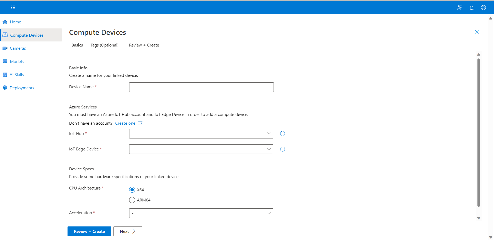

3.  Enter a **Device** **Name**.
4.  From the **IoT Hub** dropdown list, select an IoT Hub.  
    If your signed-in account is associated with an Azure account, the list displays your current IoT Hub names.

    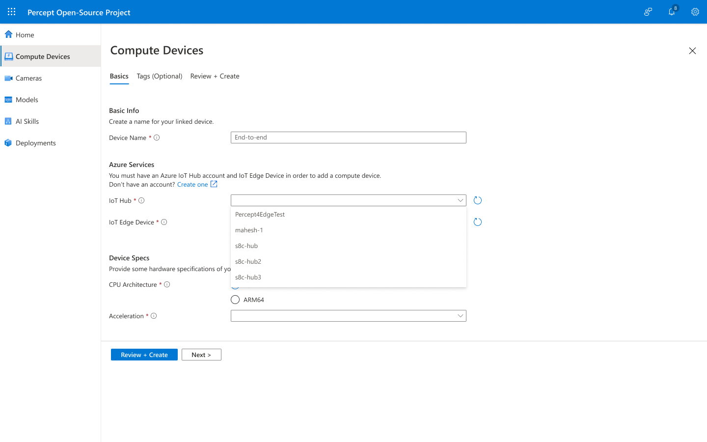

5.  From the **IoT Edge Device** dropdown list, select an IoT Edge Device.  
    If your signed-in account is associated with an Azure account, the list displays your current IoT Edge Device names.
6.  Under **Device Specs**, for **CPU Architecture,** select **X64**.
7.  From the **Acceleration** dropdown list, select **CPU**, and then select **Next**.
  
    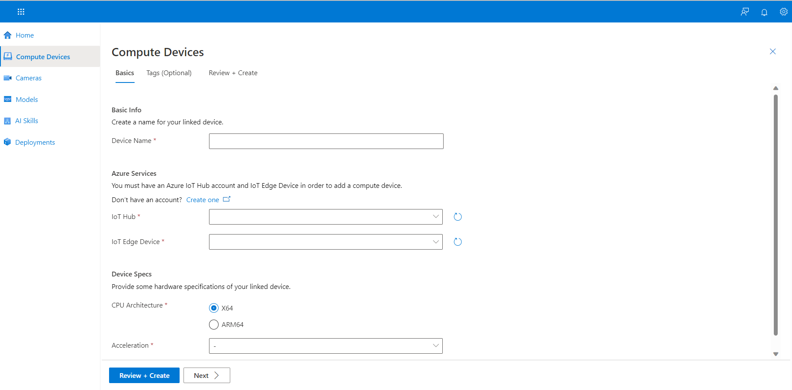

8.  Select **Review + Create**.

    The Portal validates your entries.

    -   If there are no errors, skip forward to the next section, **Add a camera**.
    -   If there are errors, you can fix them by selecting the **Edit Compute Device** link.

    Once each entry passes the review, the following message appears:

**You have now completed connecting your compute device. This device is now displayed on the Compute Devices page**.

## Step 2: Connect a video feed pointing to pedestrians or vehicles by adding and configuring a camera

SYMPHONY supports internet protocol (IP) cameras that use RTSP.

1. To add a camera and configure its properties, on the left navigation, select **Cameras,** and then select **Add Camera**.

    The **Cameras** page appears.

    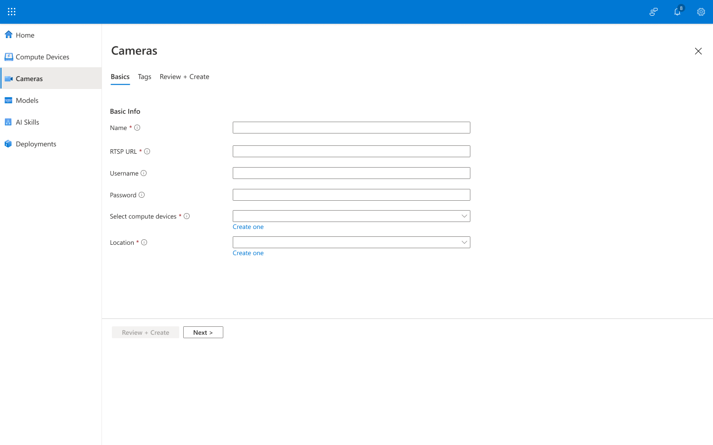

2. Add the **Name, RTSP URL**, and **Compute Device** for your camera.

    -   Each camera must have an **RTSP URL** that the RTSP protocol can use for managing its feed. For this tutorial we created an RTSP simulator for you that you can use it if you don’t have a real camera available at the moment. You can leverage it easily by running the following commands and get rtsp urls showing real scenarios:
    -   view your clusters by running: kubectl config view
    -   Pick one from the list and set by running: kubectl config set-cluster YourClusterName
    -   kubectl create deployment rtspsim --image=mcr.microsoft.com/azureedgedevices/p4drtspsim:d923853-amd64
    -   kubectl get deployments
    -   kubectl get pods
    -   kubectl expose deployment rtspsim --type=LoadBalancer --port=554
    -   kubectl get services -A -w
    -   copy the external_Ip for the rtspsim LoadBalancer and paste it instead of the "Ingress_IP" in any of the rtsp urls below:
    
    - Then you will be able to use the following simulated videos:
    - rtsp://<Ingress_IP>:554/media/cafeteria1.mkv
    - rtsp://<Ingress_IP>:554/media/camera-300s.mkv
    - rtsp://<Ingress_IP>:554/media/co-final.mkv
    - rtsp://<Ingress_IP>:554/media/homes_00425.mkv
    - rtsp://<Ingress_IP>:554/media/lots_015.mkv
    - rtsp://<Ingress_IP>:554/media/peoplewaiting.mkv
    - rtsp://<Ingress_IP>:554/media/retailshop-15fps.mkv
    -  Alternatively, you can the use the following publicly avaialble rtsp url -  **rtsp://wowzaec2demo.streamlock.net/vod/mp4:BigBuckBunny_115k.mp4**

    -   The **Compute Device** field associates a camera feed with devices will have access to that feed. Since this is a “many-to-many” relationship, one camera feed may be processed by several compute devices and one compute device may process several camera feeds.

3. To create a **Location** for the compute device, select **Create one** (below the **Location** box), and enter **parking_lot_85thStreet**, since we are monitoring pedestrian and vehicle traffic in the 85th Street parking lot.

    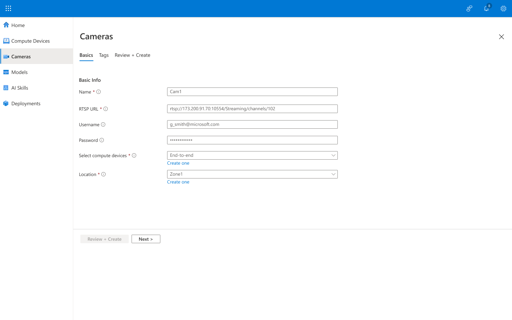

4. Select **Review + Create**.

    The portal validates your entries. If there are errors, fix them by selecting the **Edit Device** link.

    Once each entry passes the review, the following page appears:

    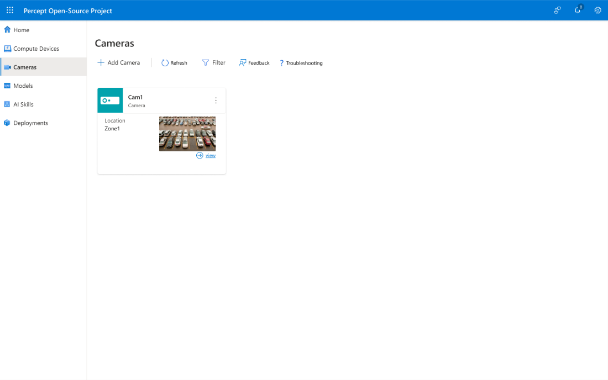

5. To see a playback video, **select the View** link at the bottom right of the camera tile. Note that you’ll see a captured image if the camera is on a private network.

    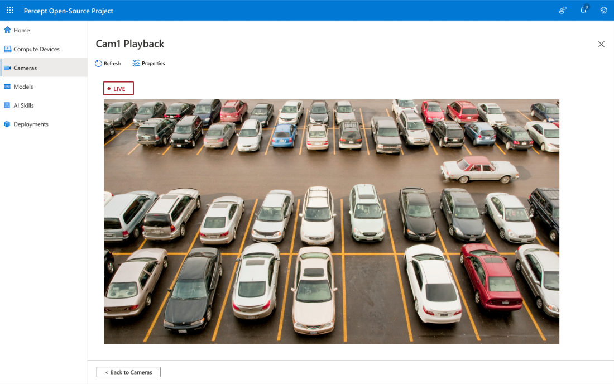

**You have now added a camera and configured its properties.**

## Step 3: View models

A model is a machine learning (ML) algorithm for object detection or classification in video streams. You can add a model from the Model Zoo, a current project, or create one from scratch. For this tutorial, we’ll use a pre-built model from the Model Zoo.

1. From the left navigation, select **Model**.

    The **Model** page displays two options for adding models to the workspace:

    - **Create custom model**, where you can create a custom model that allows you to bring 10-15 images and train the model yourself.
    - **Browse Model Zoo**, where you can select a pre-built model that works out of the box.

    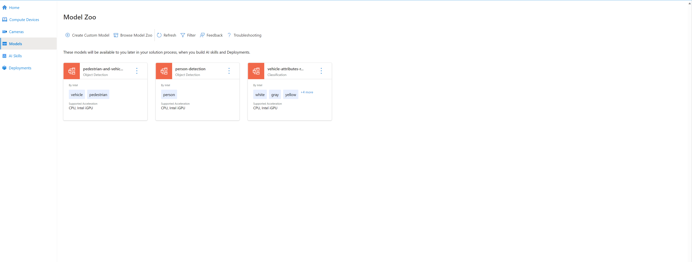

2. Select **Browse Model Zoo** to choose a pre-built model from the Model Zoo.
3. The Model Zoo page appears, displaying information about each available model.  
    For more information about a model, select the tile.

    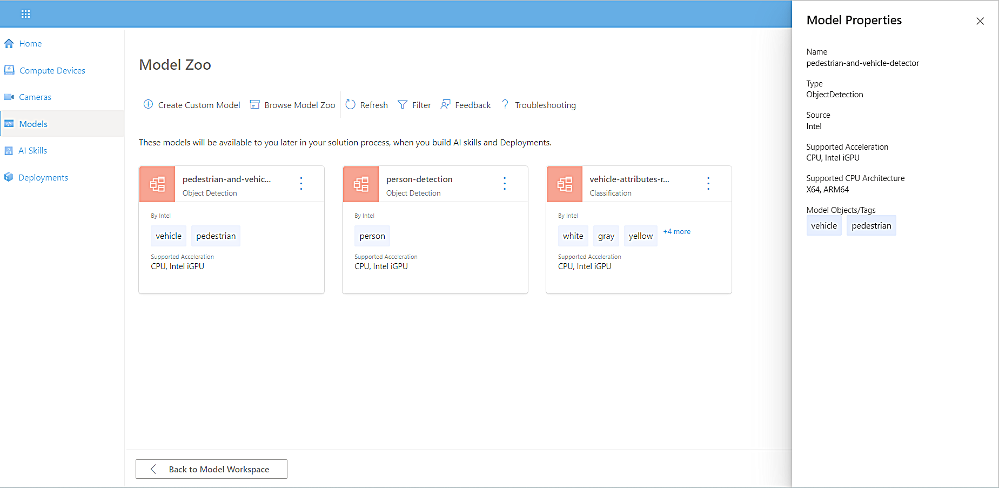

4. In this tutorial, since we’re learning how to leverage pedestrian and vehicle detection to understand occupancy in a parking lot or on a street, select **pedestrian-and-vehicle-detector**.

    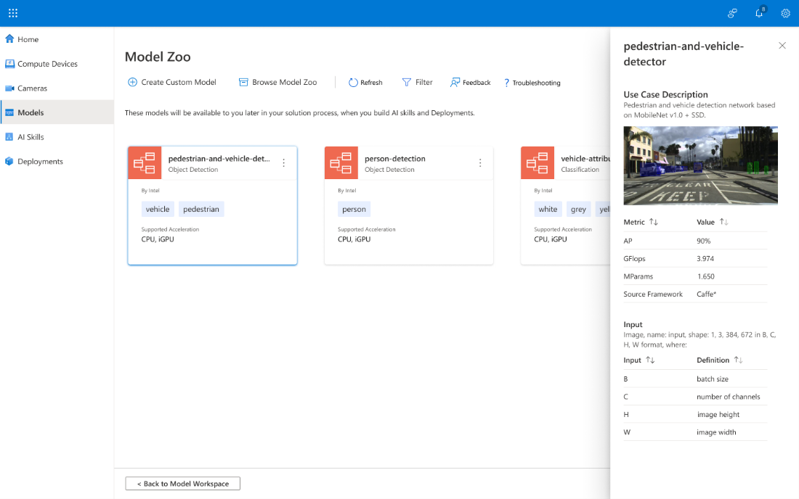

The **pedestrian-and-vehicle-detector** attribute box opens on the right side of the **Model Zoo** page. It displays the following:

- A **Use Case Description** section for the model, including the neural network model upon which it is based. This is important because those neural networks may have significant differences that affect the performance for your Edge device.
- A **Metric** section that reflects the accuracy, compute requirements, parameters, and the source framework.
- An **Input** section that describes the attributes of the video input. You can sort the model and camera input by their associated metadata.

5. To close the **Attribute** box, select **Exit**.

    To reopen the **Attributes** box later, select the ellipsis **(…)** in the corner of the tile.

## Step 4: Build an AI skill to increase accuracy and efficiency

SYMPHONY’s AI skill makes the inferences that power decision making and any follow-on actions. You can run them with a single model or multiple models and business logic. In this tutorial, we’ll be adding an AI skill based on the model we selected in the previous step and stream the inference results to IoT hub.

1. From the left navigation, select **AI Skills**, and then select **Create AI Skill**.

    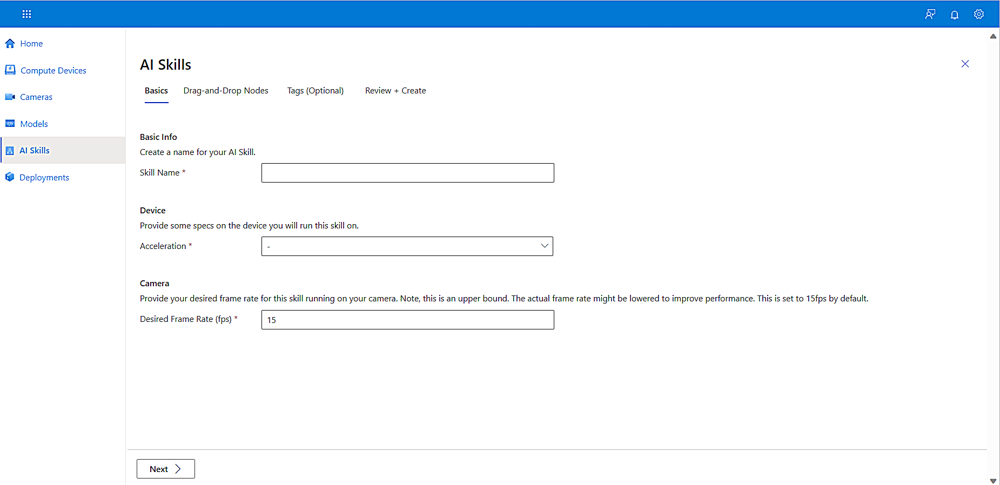

2. Add the **Skill Name**.
3. From the **Device** dropdown list, select specs on the device you will be running.
4. Under **Camera**, enter the **Desired Frame Rate (fps)** you want, then select **Next**.

    - Ensure the acceleration you select matches the one defined in the **Compute Devices** page: **CPU**
    - Note that each camera has a frame rate upper bound with the default at 15 fps. You can leave the default for our scenario.

    

5. The **Drag-and-Drop Nodes** tab appears so you can create a *node*.

    A node is a draggable object that allows you to connect models and business logic easily without writing any code. There are three types of nodes:

    1.  A **model node** is an ML algorithm like the Pedestrian and Vehicle Detector node you viewed earlier in Step 3 of this tutorial. This model outputs *x* and *y* coordinates and a confidence threshold of the object’s identification. These coordinates are used to draw a bounding box around objects.
    2.  A **transform node** takes the inference results based on the objects you detected from the model and filters them by confidence level.
    3.  An **export node** sends filtered results or video snippets to a location you define.

        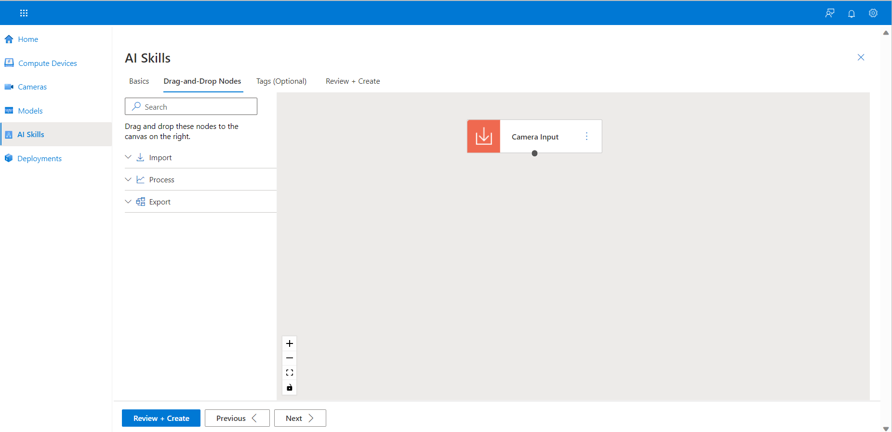

6. From the left navigation, select **Process**. A list of nodes appears.
7. Drag **Run ML Model** onto the canvas.

8. Connect the **Camera Input** node to the **Run ML Model** node by clicking the input node output dot (your cursor will turn into a crosshair) and connecting it to the model input dot.  
    When these nodes are connected, the **Classification Model** side panel opens to prompt you to select a model type.  

    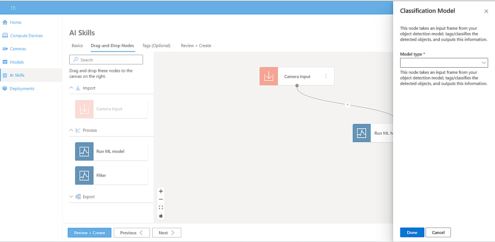
    
9. From the **Model Type** dropdown list, select a model type. For this tutorial, select **Object Detection**.

10. From the **Select object detection model** dropdown list, select **pedestrian-and-vehicle-detector**.

    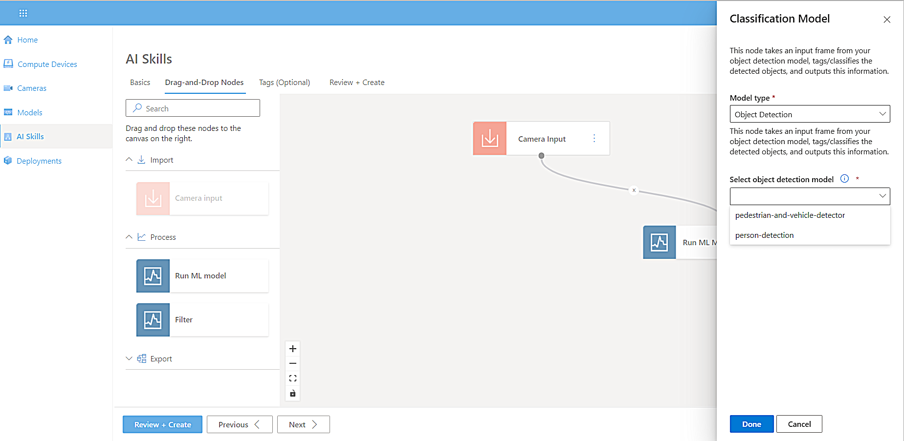

11. Select **Done.**  
    The name of the model node changes to **pedestrian-and-vehicle-detector.**

    To filter our results by confidence interval, select **Transform**, select **Filter**, and then drag the filter node onto the canvas.

12. Connect the **pedestrian-and-vehicle-detector** model node output to the **Filter** node input.

    A side panel appears for you to define the objects detected by the model and set the confidence interval.

    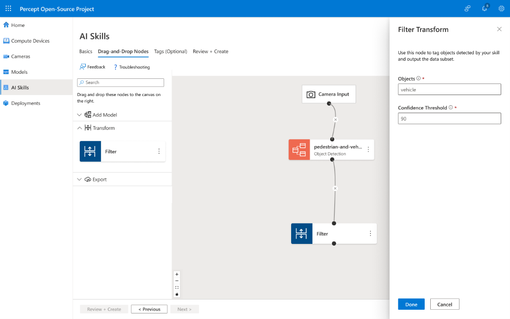

13. Select **Vehicle** as the object for the filter and the confidence threshold, and then select **Done**. Depending on the use case, the confidence threshold may vary.

    Next, we’ll analyze insights from the model by streaming the inference data back to the IoT Hub.

14. Select **Export**, drag **Send Insights to IoT Hub** onto the canvas, and then connect it to the model node.
15. To limit the number of messages sent to IoT Hub at the specified frequency, connect the **Model** node to the **Export** node.
16. When the side panel opens, select a **Delay Buffer**, and then select **Done**.

    The **Delay Buffer** prevents too many video snippets from uploading at the same time. It sets the minimum delay time to wait before uploading the next video.

    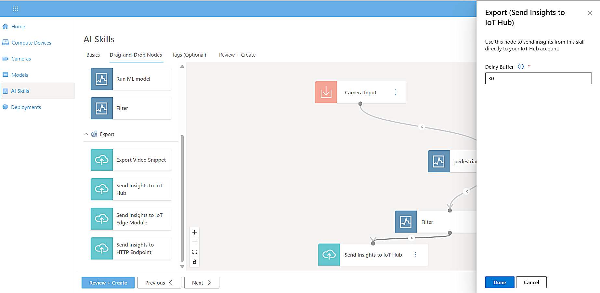

17. Select **Export**, drag the **Export Video Snippet** onto the canvas and connect it to the model node.
18. Connect the **Model** node to the **Export** node. A side panel opens to prompt you to select a **Filename Prefix, Snippet Duration,** and **Delay Buffer**.  
    Select **Done**, and then select **Review and Create.**  
    The review process validates your selections.
19. To create the skill and add it to the AI Skills library, select **Create**.

    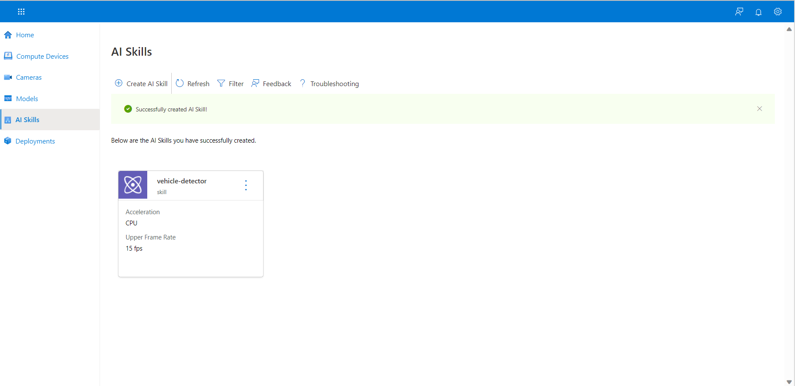

    **You have now completed adding an AI skill. This AI skill is now displayed on the AI Skills page. In the next step we’ll bring it all together and deploy your Edge AI solution.**

## Step 5: Deploy your Edge AI solution

Creating a deployment is the last major step in this tutorial. The last blade on the left navigation, **Deployments**, provides you with a straightforward, guided workflow to complete this process. You’ll be prompted to enter basic information about the compute device and camera you set up earlier in this tutorial.

1.  To configure your deployment, select **Create Deployment**.

    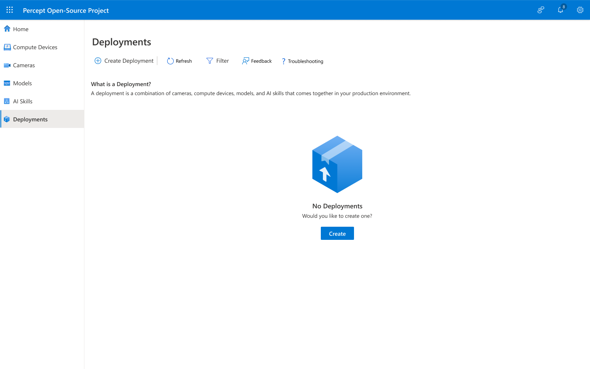

2.  In the **Deployment Name** box, enter a name for your deployment.
3.  From the **Compute Device** dropdown list, select the device you added in the **Connect a compute device** step earlier in this tutorial.

    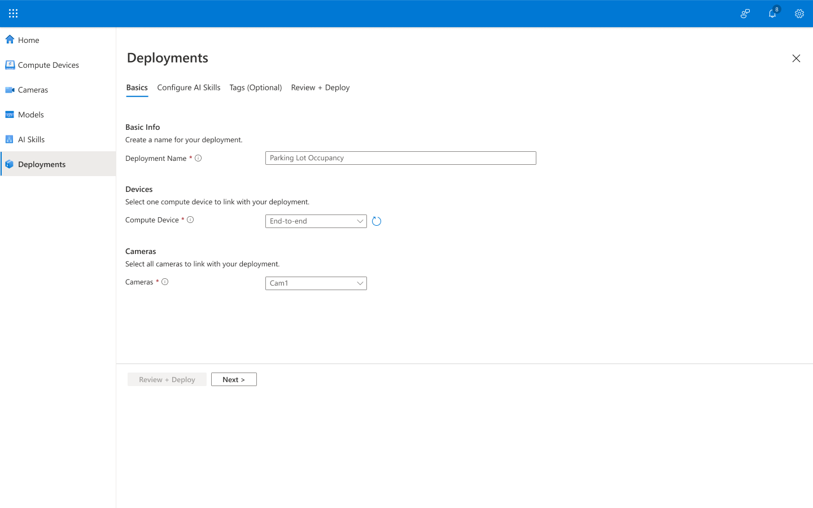

4.  From the **Cameras** dropdown list, select the camera you added in the **Add a camera** step earlier in this tutorial.
5.  To open the **Configure AI Skills** tab, select **Next**.

    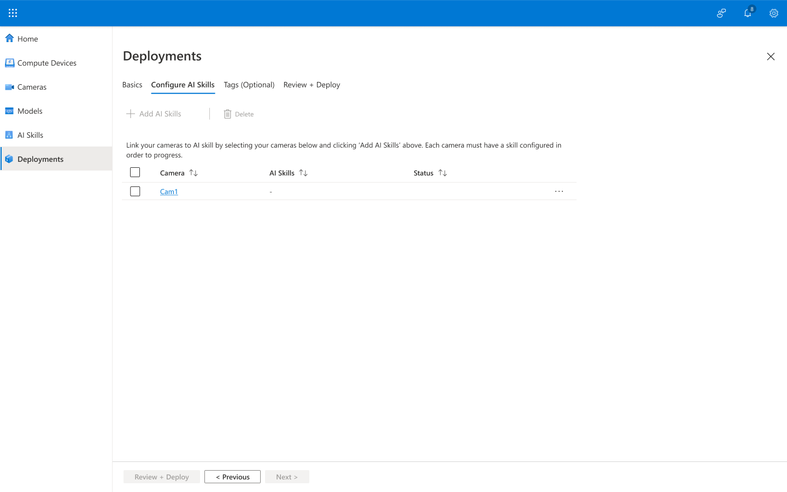

6.  To configure the AI Skill, select the camera, select **Add AI Skills"**, select the AI Skill you want, and then select **Add**.  
    The **Add AI Skills** pane opens on the right, displaying the AI skill you created earlier in this tutorial.
    
7.  Select the AI skill to add it to your camera, and then select **Configure**.
8.  Select **Review + Deploy** to move to the next step.

    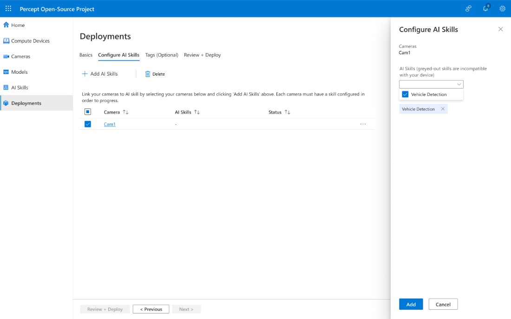

9.  On the **Review + Deploy** tab, review your settings, and then select **Deploy**.

    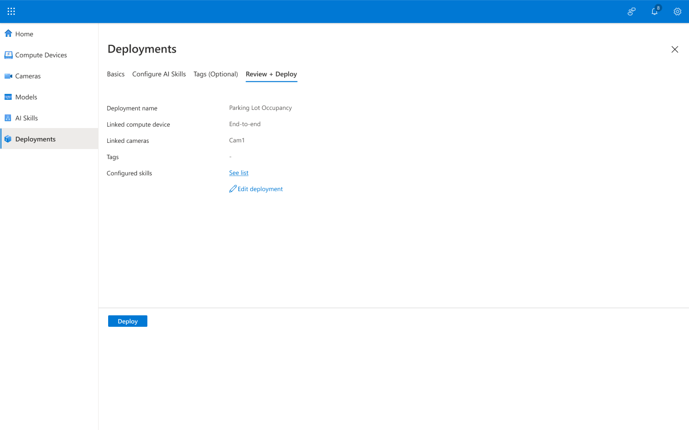

    **You have now successfully created an Edge AI solution with SYMPHONY Portal.** The AI skill you selected on your compute device is now processing your video feeds and generating insights.

### View the deployment library

Now that you’ve deployed your solution, you’ll see a digital representation of the physical world and be able to keep up with what’s going on in your environment. You can view inference results and actionable, event-based videos that help you understand your physical environment and then react in real time, using the inferences from IoT Hub to optimize your operations at the edge and integrate it with other Azure services. You can also view the performance of your AI skills and validate that your solution is working as you expect and is providing you with the information that you need.

You can view the deployment you just created and a library of other deployments you’ve created on the **Deployments** page in SYMPHONY Portal.

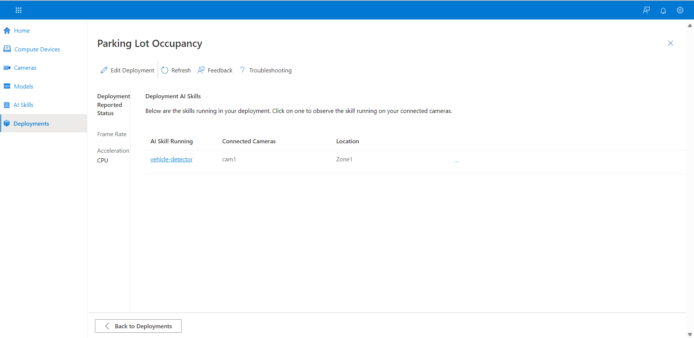

1. To view a list of your AI skills, the cameras associated with them, and their locations, select a deployment.

    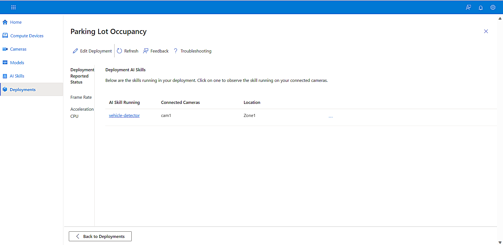

2. To view the details of a skill, select the skill.  
   A page displaying details about the skill opens.

    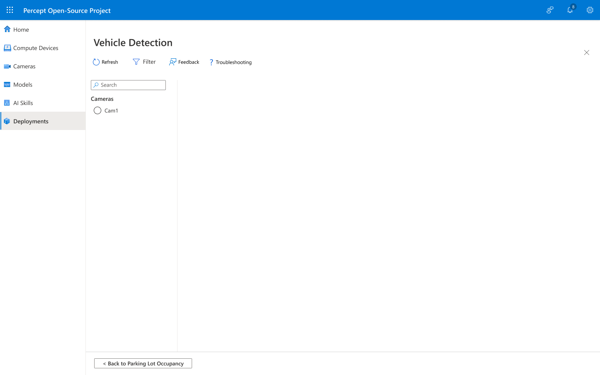

3. Select a camera, then to display feed and status information, select the **General** tab.

    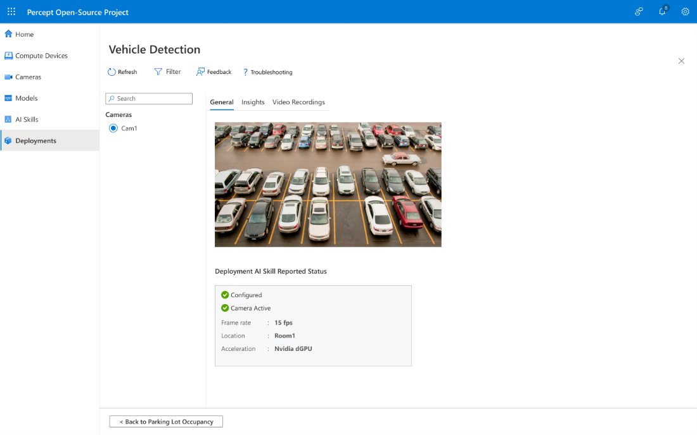

   The **General** tab displays the configuration status, camera status, frame rate, and location.

4. To display the recording names and their timestamps, select the **Video Recordings** tab.

    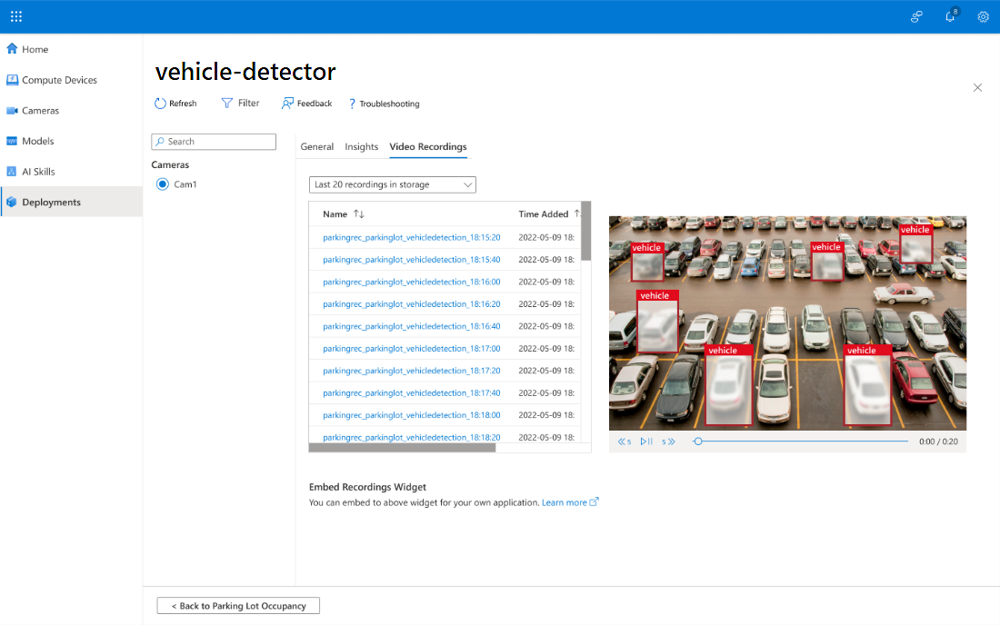

5. To display inferences for: **confidence**, **position**, **label**, and **time,** select the **Insights** tab.
6. To export this data for further use or analysis, select your language from the **Embed Code** dropdown list.

    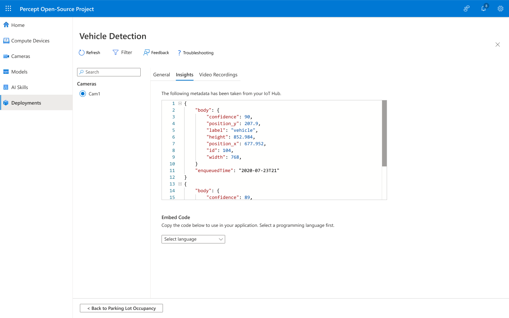

**Congratulations! You have now successfully created and deployed an Edge AI image classification solution with SYMPHONY Portal.**

## Next steps

Now that you have successfully created an Edge AI solution with SYMPHONY Portal, we recommend the following resources:

- [How-to guide: Create a complex AI skill with SYMPHONY Portal AI skill builder](/docs/tutorial/Create-a-complex-AI-skill.md)

- [How-to guide: Create a custom model using SYMPHONY Portal](/docs/tutorial/Create-a-custom-model.md)
