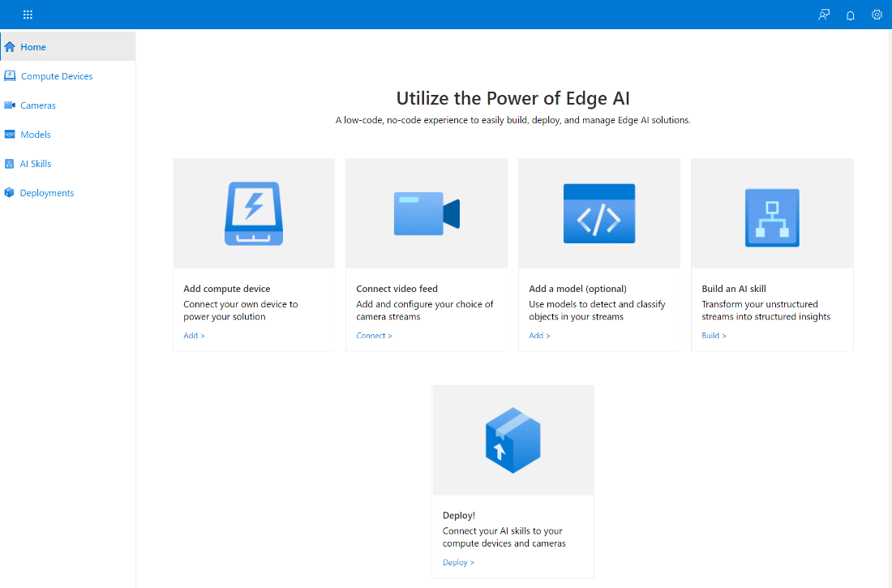
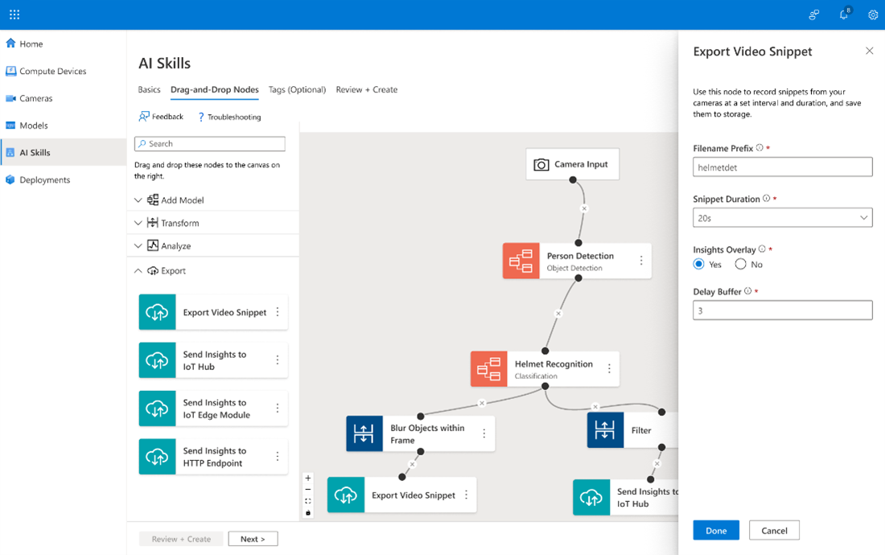

# Introduction to Azure Percept for Open-Source Project Core Concepts

Azure Percept for Open-Source Project (POSS) is a framework for creating, deploying, and operating Edge artificial intelligence (AI) solutions at scale with the control and flexibility of open-source natively on your environment. It is fully open-sourced and leverages the open-source software (OSS) community to deliver enhanced experiences. And, as a self-managed solution, you can host the experience on your own Kubernetes clusters.

This article provides you with a deep understanding of Azure Percept for Open-Source Project portal concepts; We’ll cover the following five key concepts:

1.  Compute Devices
2.  Cameras
3.  Models
4.  AI Skills
5.  Deployments

After reviewing this article, visit the [Tutorial: Create an Edge AI solution with Azure Percept for Open-Source Project](https://github.com/Azure/PerceptOSS/blob/main/docs/tutorial/Tutorial-Create-an-Edge-AI-solution-with-Azure-Percept-Open-Source-Project.md) for step-by-step guidance on how to create an end-to-end Edge artificial intelligence (AI) solution.

## 1. **Compute Devices**

A compute device is an essential part of the [Azure Percept for Open-Source Project](https://github.com/Azure/PerceptOSS) architecture. It holds all the components of the vision-based Edge AI deployments and executes close to the operating environment in real time. It is highly configurable and capable of processing several camera streams at once.

Azure Percept for Open-Source Project and its Edge AI solutions are supported on many different devices and accelerators, for example, NVIDIA Orin AGX/NX, Xavier AGX/NX, Azure Stack HCI, and Azure stack edge.

### Configuration options

The following table provides information about the compute devices and configuration options available to you.
| **Acceleration**                                                                                                                   | **OS (Operating Systems)** |
|------------------------------------------------------------------------------------------------------------------------------------|----------------------------|
| **X64** **CPU (central processing units)**                                                                                         |                            |
|<ul><li>CPU GPU (graphic processing units)</li><li>Nvidia A2, T41 VPU (Video Processing Unit)</li><li>Intel Movidius Myriad X22</li><li> iGPU (integrated GPU)</li></ul>|<ul><li>Ubuntu 20.04</li><li>CBL-Mariner</li></ul>
| **ARM64 CPU**                                                                                                                      |                            |
| <ul><li>Nvidia Jetson (Jetpack 5)</li></ul>|<ul><li>Ubuntu 20.04</li></ul>               |

### Acceleration options for building your Edge AI solutions

There are three acceleration options available for building your Edge AI solutions:

-   **CPUs** - The slowest hardware for acceleration; however, the performance range may vary by a factor of ten. The fastest CPUs compete well with midrange iGPUs. You can use CPUs to run simple models, mostly for non-real time scenarios such as: understanding shelf availability for low stock in a retail setting that can be processed once an hour.
-   **Integrated GPUs (iGPUs) -** Faster than CPUs but perform at approximately 50% of dedicated GPUs. They are dependent on other system characteristics, like RAM speed, since they share RAM with the CPU.
    -   Moderate complexity models – detection or classification algorithms
-   **GPU and VPU** acceleration offer similar performance gains. While VPUs are designed specifically for machine vision applications, GPUs specialize in rapid vector mathematics suitable for rendering images and animation. This option is considered a continuing resource for machine learning models.

    Additionally, VPUs consume significantly less power and therefore generate less heat. This may be an issue to consider if your solution requires small form factor devices. You can use these accelerators for real time scenarios such as: understanding when a person enters a restricted area or near a moving vehicle.

When choosing an acceleration option, you must also take model performance into account. For example, a MobileNet3 v3 large model has an accuracy of 75.6 versus the smallest MobileNet v3 model which has an accuracy of 61.9. Larger models require a GPU or VPU while smaller models can run on a CPU.

The following table provides general guidelines for your hardware options:

| **Acceleration** | **Simple Model** | **Complex Model** | **Real-time Required** | **Safety or Critical Impact** |
|------------------|------------------|-------------------|------------------------|-------------------------------|
| CPU              | :heavy_check_mark: |                   |                        |                               |
| Intel iGPU       | :heavy_check_mark: | :heavy_check_mark: | :heavy_check_mark:    |                               |
| GPU              | :heavy_check_mark: |:heavy_check_mark:  | :heavy_check_mark:    | :heavy_check_mark:            |
| VPU              | :heavy_check_mark: |:heavy_check_mark:  |:heavy_check_mark:     | :heavy_check_mark:            |
| Jetson           |:heavy_check_mark:  |:heavy_check_mark:  | :heavy_check_mark:    | :heavy_check_mark:            |

If your solution falls into multiple categories, choose the option with the best performance. For example, if you have a simple model that requires real-time response, choose a dedicated GPU or VPU.

## 2. Cameras

Internet protocol (IP) cameras are versatile sensors that stream real time data you can use to analyze, generate insights, and trigger action in real time. IP cameras send video feeds to compute devices that use machine learning (ML) models to process the streams and generate inference results. Each camera can be associated with its physical location so you can easily filter and search for it in the portal.

## 3. Models

A model is a machine learning (ML) algorithm, we support object detection and classification models. You can use prebuilt models from Model Zoo or create your own model with custom vision.

### Prebuilt models from Model Zoo

You can use prebuilt models from the model zoo in your Edge AI solution. Currently there are three models in the zoo:

1. pedestrian and vehicle detection
2. person detection
3. vehicle attributes recognition

In a future release the [OpenVINO](https://docs.openvino.ai/latest/model_zoo.html) model zoo will be available for importing into an AI skill. OpenVINO has 200 neural network models from which you can choose to best fit your solution. The models include model complexity and size considerations as well as support for acceleration hardware. Model Zoo models are already trained.

### Custom models with custom vision

You can also create your own custom model from scratch. Just supply any 15 images based on your use case, label them via a graphical user interface (GUI), and within minutes, you can train them based on our standard models. You can easily configure to collect additional training data directly from your cameras based on your model’s confidence and continuously improve the models based on the physical environment.

## 4. AI Skills

In Azure Percept for Open-Source Project, AI skills define a processing graph with cascaded models and other processing nodes like transformer and exporter. They make the inferences that power decision making and any follow-on actions. They can be run with single or multiple models and nodes.

There are three groups of nodes that comprise AI Skills:

1.  **Model** – Machine learning models for detection and classification. You can use a pre-built model from the Model Zoo, a custom model that you built using the portal, we are also working on a feature that will allow you to bring your own model that will be available soon.
2.  **Transform** – Nodes that transform and enrich data.

    Transform nodes can filter classes/labels that the model predicts, it is useful when the models output many classes/labels and you want to focus on a specific use case.

3.  **Export** - Nodes that help you export raw inference data

    Export nodes help you export raw inference data and actionable insights to a broad range of locations to the edge or to the cloud. These nodes are located locally at the edge, so you can also connect custom IoT Edge modules that allow you to integrate with other applications and systems in your environment.

This screenshot displays some of the nodes Azure Percept for Open-Source Project supports:

   To summarize, you can chain nodes together in an AI skill to allow the result of one model to feed into the next. For example, the first model may detect vehicles and pass this information to a model that classifies vehicles by type; for example, car, truck, or bus. Based on user defined logic, these insights can be sent to IoT hub, you can also capture video snippets when an event of interest triggered, and it will be stored in your storage account.
   

## 5. Deployments

After defining your compute devices, cameras, models, and AI skills, your next step is to package and deploy them to your target device via the portal. When a deployment is live, you can monitor camera feeds and recordings, gather inference results from a feed, and reconfigure your deployment as needed to get the information you need.

## Next steps

Now that you understand the main concepts in the Azure Percept for Open-Source portal and the key considerations for creating your Edge AI solution, we recommend the following resources to get started:

-   [Get started](https://github.com/Azure/PerceptOSS/blob/main/docs/tutorial/setup-guide.md)
-   [Tutorial](https://github.com/Azure/PerceptOSS/blob/main/docs/tutorial/Tutorial-Create-an-Edge-AI-solution-with-Azure-Percept-Open-Source-Project.md)
