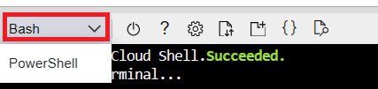

# KAN: Setup guide

## Prerequisites

KAN runs with or without Azure. When you configure KAN with Azure, you get additional features like:
* Sending inference results to IoT Hub
* Automatic uploading video snippets to Azure Storage account
* Leveraging Azure Custom Vision models

On the other hand, you can get started with KAN without an Azure account.

### Run without Azure

* A **Kubernetes cluster**. 

  If you don't have an existing Kubernetes cluster, you can easily create one using the Azure Kubernetes Service (AKS). For more information, visit [Quickstart: Deploy an Azure Kubernetes Service (AKS) cluster using the Azure Portal](https://docs.microsoft.com/en-us/azure/aks/learn/quick-kubernetes-deploy-portal?tabs=azure-cli). Make sure to choose Standard DS3 v2 for the node size.

  > **NOTE:** If you are using [MicroK8s](https://microk8s.io/), you should create a alias for `kubectl`, such as `sudo snap alias microk8s.kubectl kubectl`

* A **Bash Shell**, such as WSL, Azure Cloud CLI, or a Terminal on Mac.
* **Helm** v3.8 or higher.

### Run with Azure

To run with Azure, in addition to above items, you’ll also need:

* An active **Azure subscription** with **Owner** role access. 

KAN installer script will guide you through the steps of creating related Azure resources (see more details below).

## Setup process 

1. Open your shell terminal. If you use [Azure Cloud Shell](https://learn.microsoft.com/en-us/azure/cloud-shell/overview), ensure that you switch to Bash option in Azure Cloud Shell. 

   

2. Download and launch the installer script:
   ```bash
   bash <(wget -qO- https://raw.githubusercontent.com/Azure/KAN/main/Installer/kan-installer.sh)
   ```
3. The first question the script asks is if you want to run KAN with or without Azure services. Enter ```y``` to deploy KAN with Azure, otherwise enter ```n```.
   ```bash
   *******************
   * Welcome to KAN! *
   *******************

   Use Azure services? (y/n):
   ```
   > **NOTE**: Later, you can run the installer script again to choose a different route.

## Setup process - with Azure
4. Next, you can choose to configure KAN on an existing AKS cluster, or to use your current Kubernetes context, which can point to any local or remote Kubernetes clusters.
   ```bash
   Would you like to use an existing AKS cluster or use the current kubeconfig?
      1) Use an existing AKS cluster
      2) Use current kubeconfig
   Your choice:
   ```
   If your chose ```1```, the script lists out all your AKS clusters, and you can select the cluster by entering the cluster index. If you chose ```2```, the script continues with your current Kubernetes context.

5. Next, you have options to create a new Azure Storage Account, use an existing one, or skip the step:
   ```bash
   Would you like to create a new storage account or use an existing one?
      1)  Create a new one
      2)  Use an existing one
      3)  Skip
      4)  Back to previous step
   Your answer:
   ```
   > **NOTE**: You won't be able to view camera snapshots or uploaded video clips without an Azure Storage Account.

   If you chose either ```1``` or ```2```, you then need to choose whether you want to create new storage container, or use an existing one.
   ```bash
   Would you like to create a new blob container or use an existing one?
   In order to perform this operation, please make sure you have a Storage contributor role on your subscription
      1)  Create a new one
      2)  Use an existing one
      3)  Back to previous step
   Your choice:
   ```
6. Next, you can choose which Azure Custom Vision service account to use, or to create a new one:
   ```bash
   Would you like to create a new Azure Custom Vision service or use an existing one?
      1)  Create a new one
      2)  Use an existing one
      3)  Skip
      4)  Back to previous step
   Your choice:
   ```
7. The next step is to choose an Azure Service Principal to use. We recommend creating a new one with the script in your initial setup, and reuse the same principal in subsequent script runs. Also, if you work with an Azure AD tenant with many service principals, we recommend choosing ```3``` instead of ```2``` as enumerating all service principals may take a long time.
   ```bash
   Would you like to create a new service principal or use an existing one?
      1) Create a new one
      2) Use an existing one
      3) Use an existing one by entering name
      4) Skip
      5) Back to previous step
   Your choice:
   ```
8. Next, the script asks if you want to create a custom role. If you choose to use a custom role, the scripts create a new `kan contributor <subscription id>` custom role. 
   ```bash
   Use a custom role? (y/n):
   ```
9. Next, you need to choose with Symphony agent image to use. The default Symphony agent doesn't ship with `ffmpeg`, which is required to take camera snapshots. You can choose a community-contributed image to get the snapshot feature.
   ```bash
   Choose Symphony agent image:
   We need to use a Symphony agent to capture camera thumbnails, which requires the use of ffmpeg. However, the default Symphony agent Docker image does not include ffmpeg.
      1) Use the default agent without camera thumbnail feature.
      2) Use a community-contributed image from hbai/symphony-agent:0.48.4 that supports the thumbnail feature.
   ```
9. Next, you can choose whether usage telemetries to Microsoft:
   ```bash
   May we collect anonymous usage data to help improve the app's performance and user experience (to turn it off, run this installer again)? (y/n)
   ```
  
9. Once you've made all selections, answer ```y``` to confirm. And the script will setup all required Azure resources for you.
   ```bash
   Your selections:
      AKS:                          Use current kubeconfig
      Service principal:            kansp2024
      Storage account:              kan-demo/kanstore
      Storage account location:
      Blob container:               kanblob
      Cognitive services:           kan-demo/kancv
      Cognitive services location:
      Enable collect telemetry:     false
   Are you sure (y or n)?
   ```
9. If you've chosen to use an existing service principal, it's very likely you'll need to re-enter the service principal credential:
   ```bash
   ❗ ERROR: Failed to retrieve secret. Please enter the secret manually.
   Please enter password for <sp name>:
   Please enter tenant for <sp name>:
   ```

9. After all resources are configured and KAN installed, the script displays your portal URL. Open the URL with a browser and you are ready to go!
   ```bash
   🎉 Installation Completed!!
   The platform will be ready in few minutes at http://<portal ip address>
   ```
## Setup process - without Azure

4. Scripts asks you to confirm to install KAN to the Kubernetes cluster configured as your current cluster. Answer `y` to continue.
   ```bash
   kan will install on current kubeconfig: (y/n)
   ```
5. Answer `y` to confirm installation:
   ```bash
    your selections:
    aks:                            Use current kubeconfig
    service_principal:              skip
    storage account:                skip
    storage account location:       skip
    blob container:                 skip
    cognitive services:             skip
    cognitive services location:    skip
    Are you sure (y or n)?
   ```
6. After all resources are configured and KAN installed, the script displays your portal URL. Open the URL with a browser and you are ready to go!

## Limit access to the KAN portal
Now that you have successfully setup KAN experience onto your Kubernetes environment, we recommend first securing your portal. 
  
-   [Security: Limiting User Access to your KAN Portal](/docs/tutorial/Security-Limiting-User-Access-to-your-KAN-Portal.md)


## Uninstall KAN
You can uninstall KAN using Helm:

```bash
helm uninstall kanportal
helm uninstall symphony -n symphonhy-k8s-system
```
 
## Reporting Issues and Bugs
    
Report any issues or bugs you face using the [repository's issues page](https://github.com/Azure/KAN/issues).

## Next steps

-   [Tutorial: Create an Edge AI solution with KAN portal using a prebuilt model](Tutorial-Create-an-Edge-AI-solution-with-KubeAI-Application-Nucleus-for-edge-Portal.md)
-   [Introduction to KAN: Core concepts](/docs/tutorial/concepts-kan.md)
